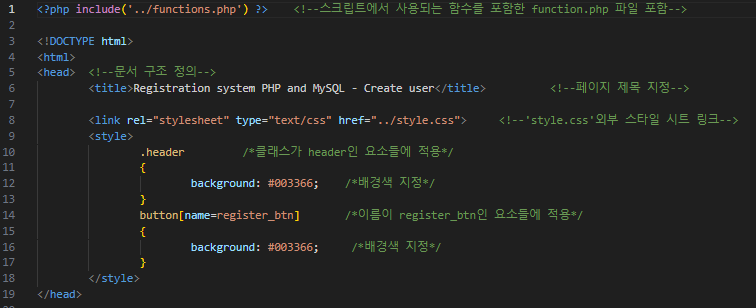
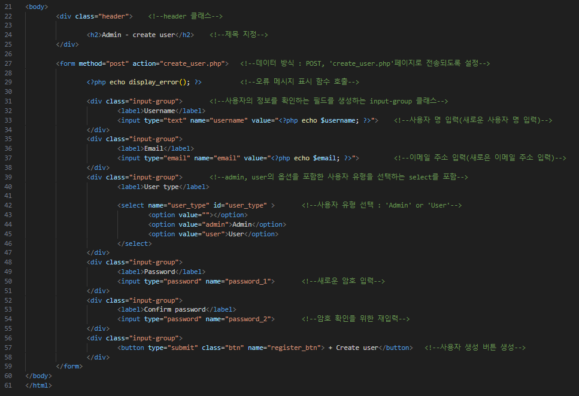
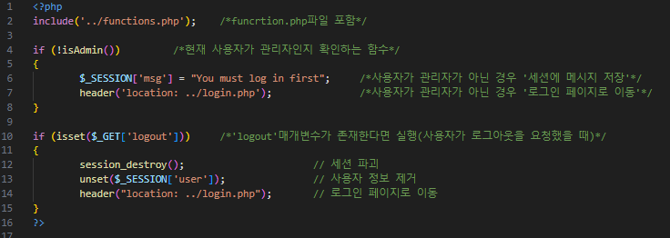
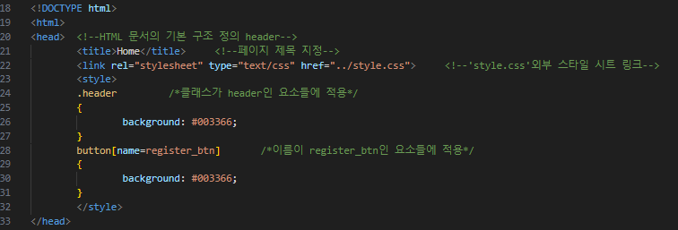
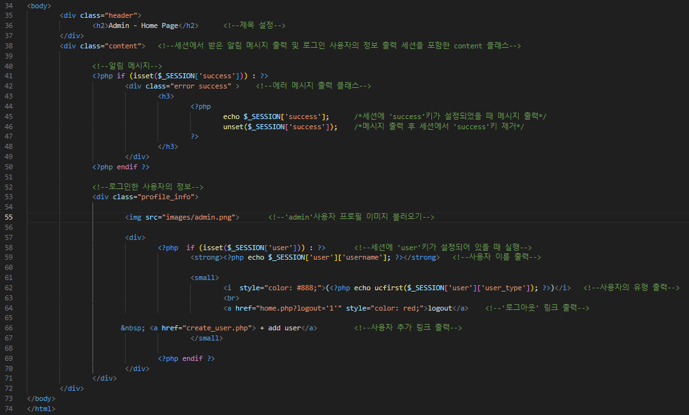

<!------------------제 목------------------------->

# 10주차 웹 프로그래밍 과제

<!----------------------- 앵커로 연결된 목차 지정--------------------------->
### (소스코드 분석 및 주석달기)

#### - 목 차 -

<li><a href="#first">1. create_user.php 소스코드 및 주석 이미지</a></li>
<li><a href="#second">2. home.php 소스코드 및 주석 이미지</a></li>
<li><a href="#third">3. functions.php 소스코드 및 주석 이미지</a></li>
<li><a href="#fourth">4. index.php 소스코드 및 주석 이미지</a></li>
<li><a href="#fifth">5. login.php 소스코드 및 주석 이미지</a></li>
<li><a href="#sixth">6. register.php 소스코드 및 주석 이미지</a></li>
<li><a href="#seventh">7. style.css 소스코드</a></li>
<li><a href="#last">8. 최종 결과 분석 이미지</a></li>

  

<!-------------------------------create_user.php-------------------------------------->

### <strong id = "first"><b>1. create_user.php 소스코드 및 주석 이미지</b></strong>
 

(create_user.php 소스코드 및 주석 이미지)
 </img> 

<!-------------------------------home.php----------------------------------->

### <strong id = "second"><b>2. home.php 소스코드 및 주석 이미지</b></strong>
 

(home.php 소스코드 및 주석 이미지)
 </img> 

<!------------------------------functions.php----------------------------------->

### <strong id = "third"><b>3. functions.php 소스코드 및 주석 이미지</b></strong>
 

(functions.php 소스코드 및 주석 이미지)
 </img> 

<!------------------------------index.php----------------------------------->

### <strong id = "fourth"><b>4. index.php 소스코드 및 주석 이미지</b></strong>
 

(index.php 소스코드 및 주석 이미지)
  </img> 

<!-------------------------------login.php---------------------------------->

### <strong id = "fifth"><b>5. login.php 소스코드 및 주석 이미지</b></strong>
 

(login.php 소스코드 및 주석 이미지)
 </img> 

<!------------------------------register.php--------------------------------------->

### <strong id = "sixth"><b>6. register.php 소스코드 및 주석 이미지</b></strong>
 

(register.php 소스코드 및 주석 이미지)
 </img> 

<!------------------------------style.css--------------------------------------->

### <strong id = "seventh"><b>7. style.css 소스코드</b></strong>
 

(style.css 소스코드)
 </img> 

<!-----------------------------최종 결과 분석--------------------------------------->

### <strong id = "last"><b>8. 최종 결과 분석</b></strong>
 

(최종 결과 분석 이미지)
 </img> 

