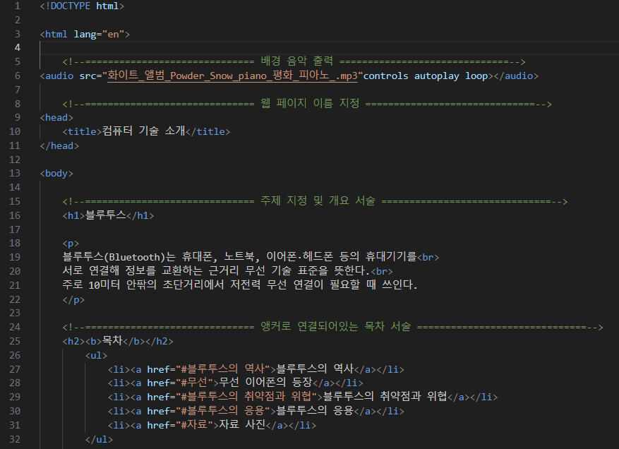
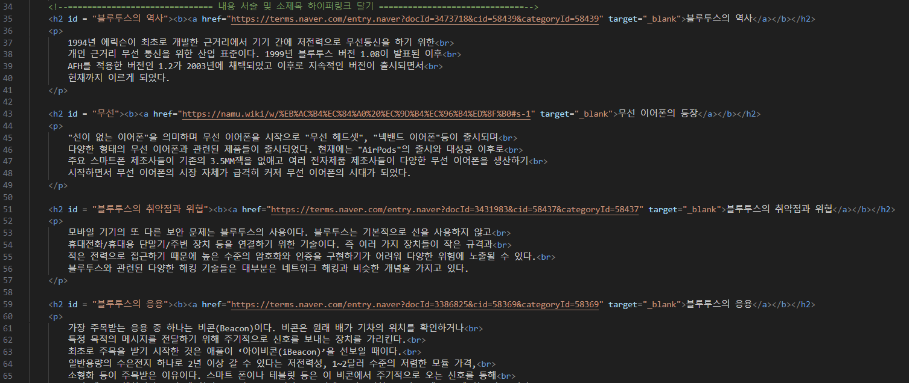
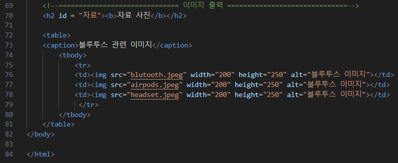
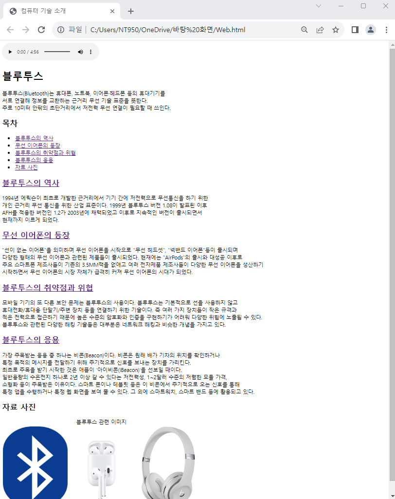

# Open Challenge 02

### 컴퓨터 기술 소개 웹 페이지 만들기 : 블루투스에 대하여

> #### 준비
> 
>    > 배경음악 음원
>    >
>    > 하이퍼 링크에 필요한 페이지 링크 4개
>    >
>    > 블루투스 관련 이미지 3장     

#### 순서

1. 배경음악을 출력할 수 있도록 오디오 파일을 삽입

2. 웹 페이지 이름을 지정

3. 주제를 지정하고그에 따른 개요 설명

4. 목차를 만들고 각 내용 소제목에 앵커를 연결

5. 소제목에 따른 내용 서술 및 소제목에 하이퍼링크 연결

6. 표를 만들고 캡션 및 블루투스 관련 이미지 삽입

 </img> 
 </img> 
 </img> 
 </img> 
