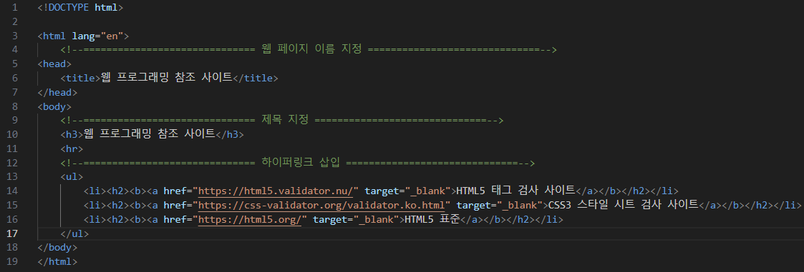
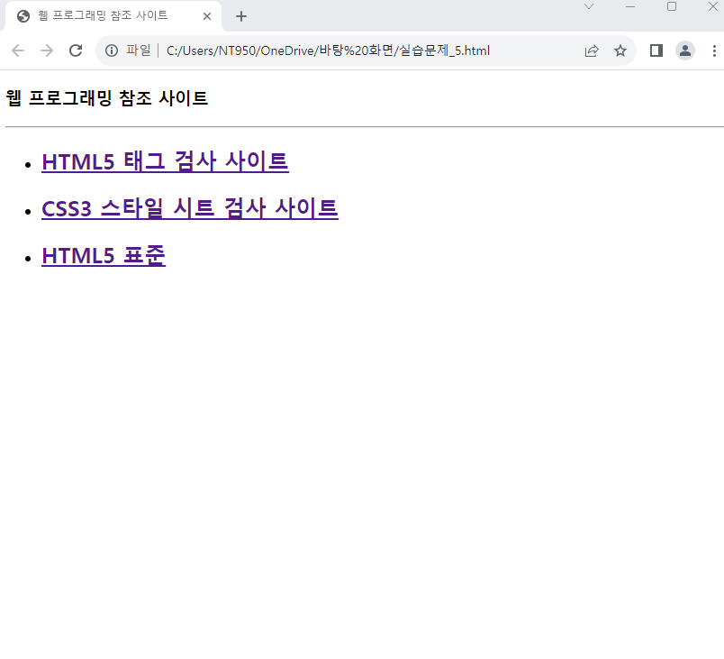

# (실습문제 5번) 문제와 같이 웹 프로그래밍 공부에 참고하기 위한 사이트들의 링크를 만들고 target="_blank"속성을 사용하여 링크가 클릭되면 새 윈도우를 열어 사이트가 출력되도록 하라.

> #### 준비
> 
>    > 하이퍼 링크를 위한 링크 3개
>
>  

#### 순서

1. 웹 페이지 이름을 지정

2. 제목 지정

3. 목차 목록을 만들고 각 목차마다 하이퍼 링크 연결
   
 </img> 
 </img> 
