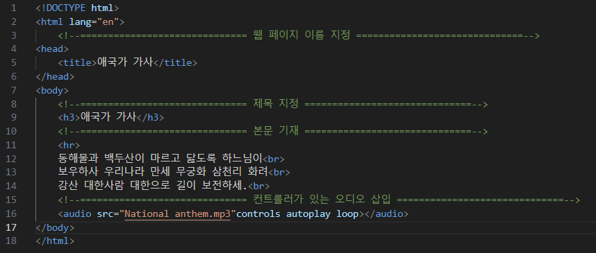
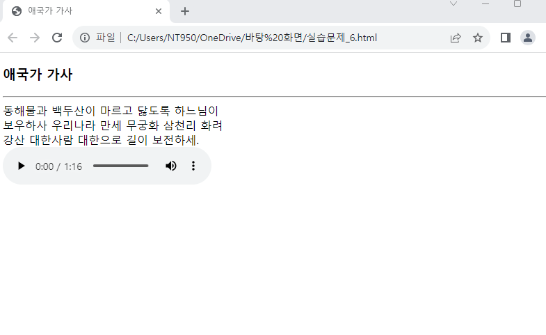

# (실습문제 6번) HTML 페이지가 화면에 출력되면 애국가가 연주되도록 하라. 애국가가 담긴 오디오 파일은 인터넷에서 찾아 삽입하든지 직접 녹음하여 사용하라. 

> #### 준비
> 
>    > 애국가 음원 또는 녹음 파일
>    

#### 순서

1. 웹 페이지이름 지정

2. 제목 지정

3. 애국가 가사 삽입

4. 컨트롤러가 표시되어있는 애국가 음원 파일 삽입

 </img> 
 </img> 
