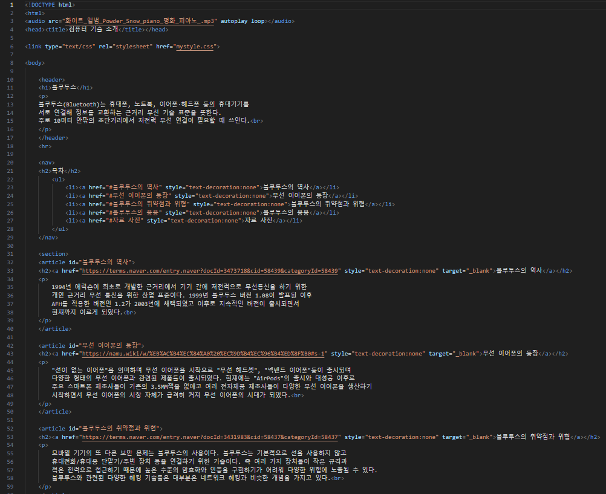
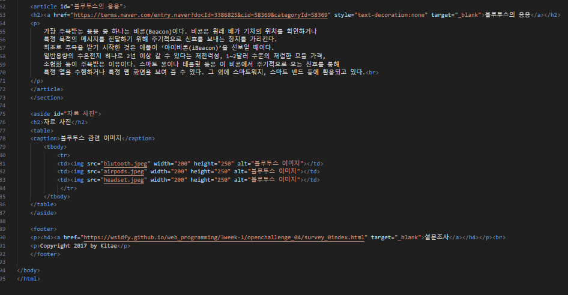
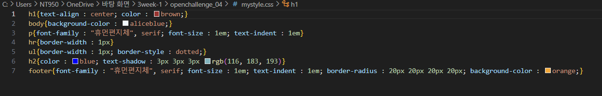
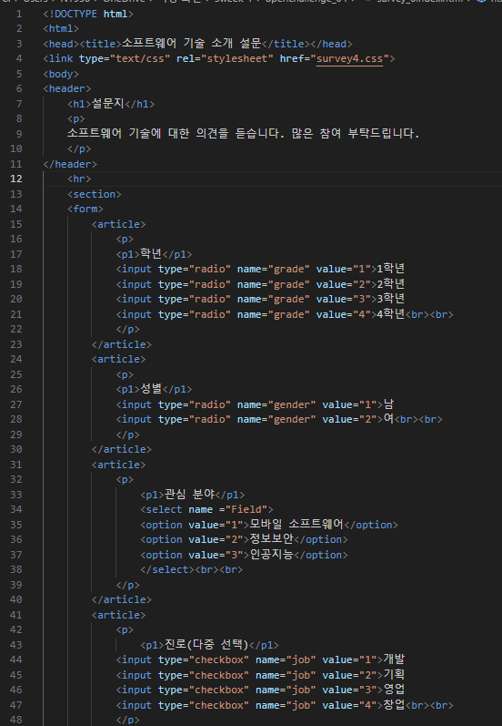
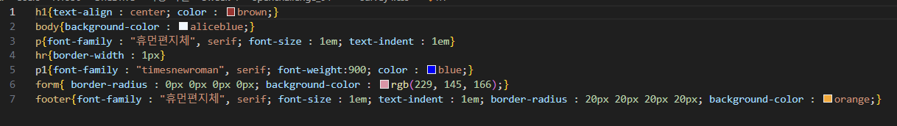
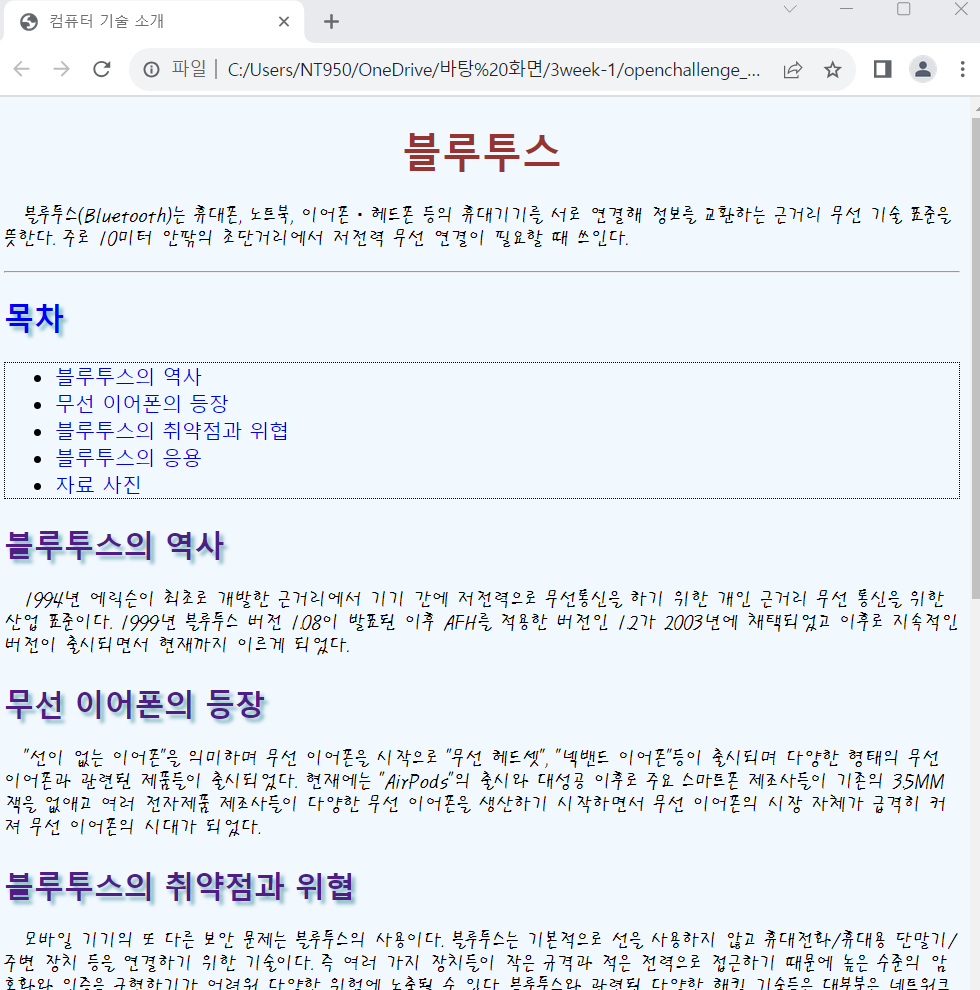
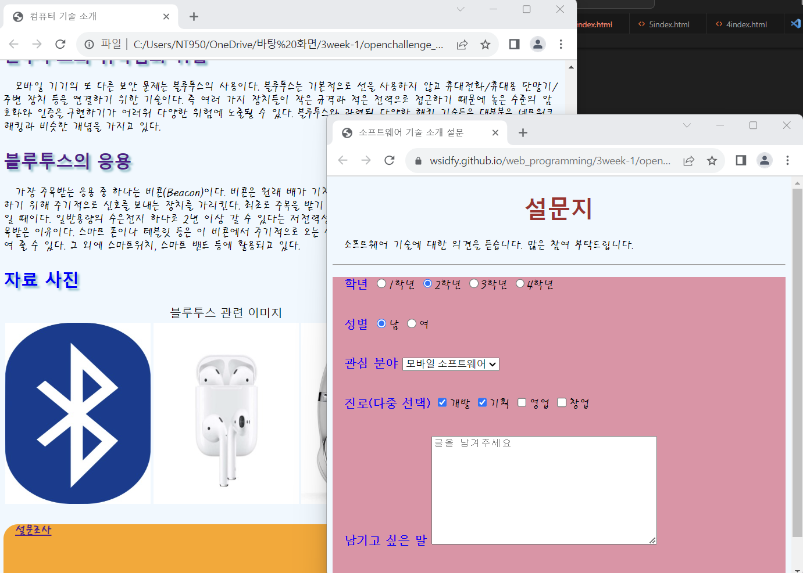

# Open Challenge 04

### 컴퓨터 기술 소개 웹 페이지 : CSS3로 모양 꾸미기

 #### 순서

>    1. brown 글자색, 텍스트 정렬 center
>    >
>    2. body 배경색 aliceblue로 변경
>    >
>    3. header의 아래쪽만 1픽셀의 직선 테두리로 변경
>    >
>    4. ul은 1픽셀의 점선 테두리로 둘러싸기
>    >
>    5. a의 링크장식 text-decoration을 none으로 하여 밑줄 없애기
>
>    6. p의 텍스트 : 휴먼 편지체, 글자크기 1em, 들여쓰기 1em으로 변경
>    
>    7. h2에는 blue글자색, text-shadow추가
>
>    8. footer에는 orange배경색, 둥근 모서리 테두리 씌우기
>
>    9. 설문조사에 survey하이퍼 링크달고 설문지 페이지 띄우기

 </img> 
 </img> 
 </img> 
 </img> 
 </img> 
 </img> 
 </img> 
