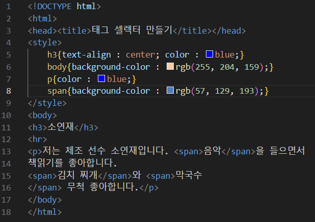
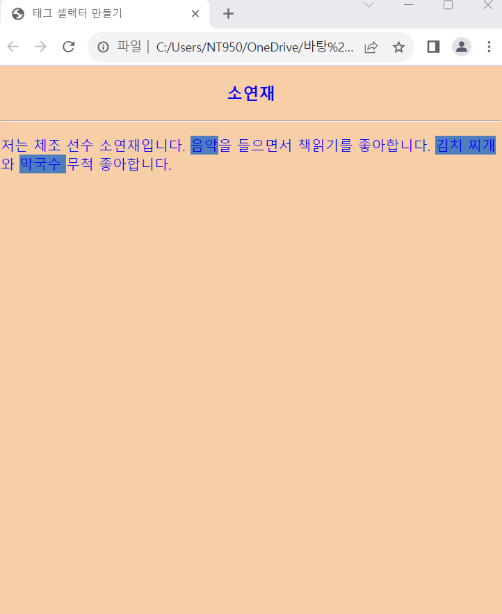

# (실습문제 1번)

### - 다음 HTML 소스에 태그 이름 셀렉터로 스타일 시트르르 삽입하여 브라우저 출력과 같게 하라.

 #### 추가 & 변경 사항

>    1. 스타일 시트 삽입
>    >
>    2. body 배경색 변경
>    >
>    3. h3 글자형식 중앙 정렬 및 파란색으로 지정
>    >
>    4. 본문 글자색 p 파란색으로 변경
>    >
>    5. span 배경색 변경

 </img> 
 </img> 
