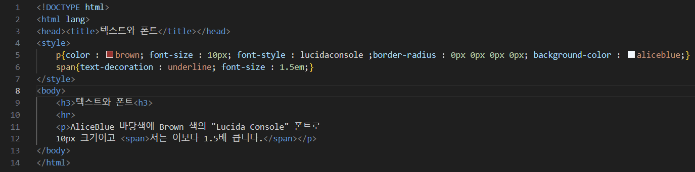
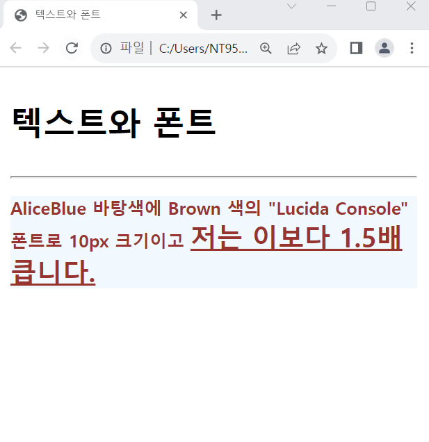

# (실습문제 2번)

### - 다음 HTML 소스에 태그 이름 셀렉터로 스타일 시트르르 삽입하여 브라우저 출력과 같게 하라.

 #### 추가 & 변경 사항

>    1. 스타일 시트 삽입
>    >
>    2. p구간 설정 변경 : 색 변경(brown), 폰트 사이즈 및 스타일, 바탕의 모서리 각도 조정 및 색변경(aliceblue)
>    >
>    3. span구역 설정 변경 : 텍스프 데코레이션(underline)추가, 폰트 사이즈 : 1.5em설정
>    >
>    3. 본문 글자색 p 파란색으로 변경

 </img> 
 </img> 
