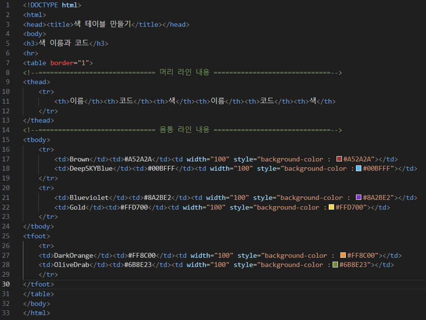
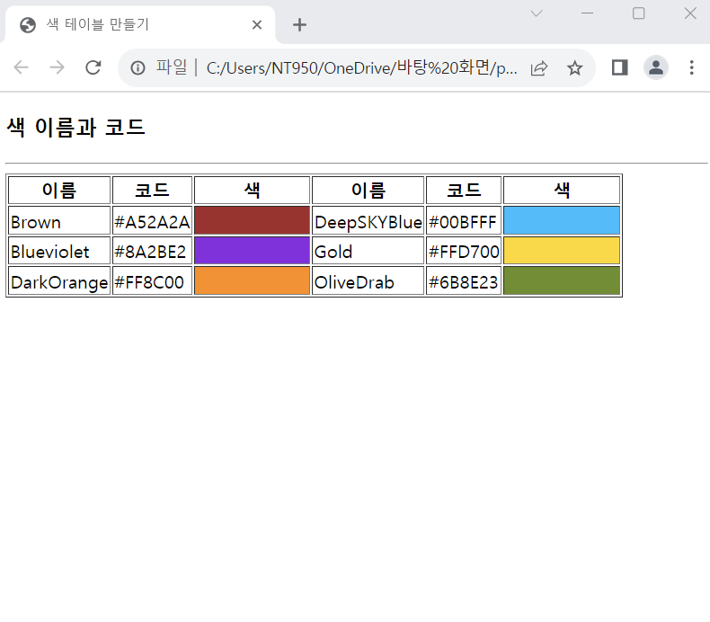

# (실습문제 3번)

### - 다음과 같이 색 이름, 색 코드, 색을 보여주는 테이블을 작성하라.

 #### 추가 & 변경 사항

>    1. 테이블 삽입
>    >
>    2. thead, tbody, tfoot구간에 들어갈 내용 설정하기(색 이름, 색 코드, 색 표시)
>    >
>    3. (단, 색이 표현되는 구간은 스타일 코드를 사용하여 지정)

 </img> 
 </img> 
