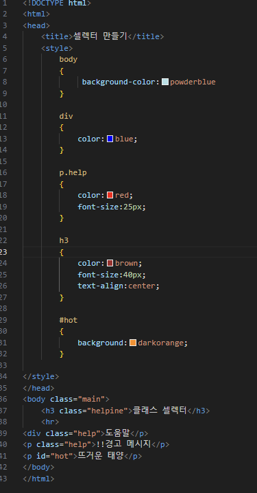
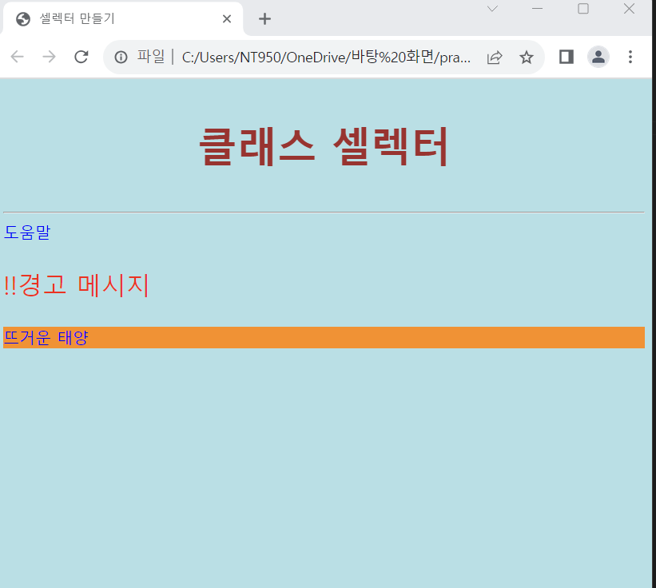

# (실습문제 4번)

### - HTML태그를 수정하지 말고 셀렉터와 스타일 시트를 삽입하여 다음과 같이 출력되게 하라.

 #### 추가 & 변경 사항

>    1. 스타일 시트 삽입
>    >
>    2. 구간별 내용 지정(body, div, p.help, h3, #hot)
>    >
>    3. body구간 배경 색 설정 : powderblue
>
>    4. div구간 컬러 지정 : blue
>
>    5. p.help구간 색 및 폰트 사이즈 지정 : red, 25px
>
>    6. h3구간 컬러, 폰트 사이즈 및 텍스트 정렬 지정 : brown, 40px, center
>
>    8. hot구간 배경색 darkorange로 지정
>
>    9. (단, body내의 구간들은 class로 스타일 시트와 연결되어 있다.)

 </img> 
 </img> 
