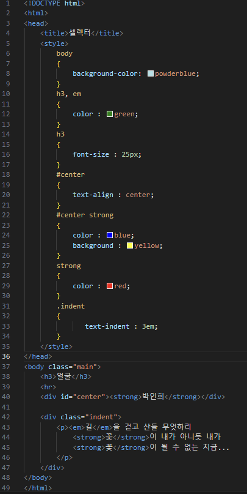
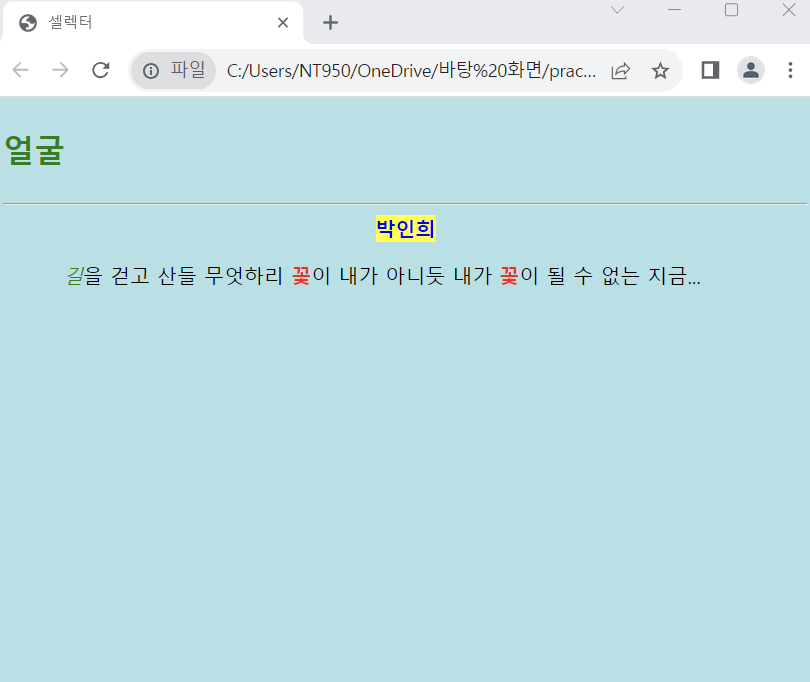

# (실습문제 5번)

### - HTML태그를 수정하지 말고 셀렉터와 스타일 시트를 삽입하여 다음과 같이 출력되게 하라.

 #### 추가 & 변경 사항

>    1. 스타일 시트 삽입
>    >
>    2. 구간별 내용 지정(body, h3, em, center, cemter strong, strong, indent)
>    >
>    3. body구간 배경색 지정 : powderblue
>
>    4. h3, em구간 컬러 green으로 설정 및 h3구간의 폰트 사이즈 25px로 설정
>
>    5. center구간 텍스트 중앙 정렬
>
>    6. center strong구간 컬러색 blue지정 및 배경색 yellow지정
>
>    8. strong 컬러색 : red
>
>    9. indent 구간 text-indent 3em 설정

 </img> 
 </img> 
