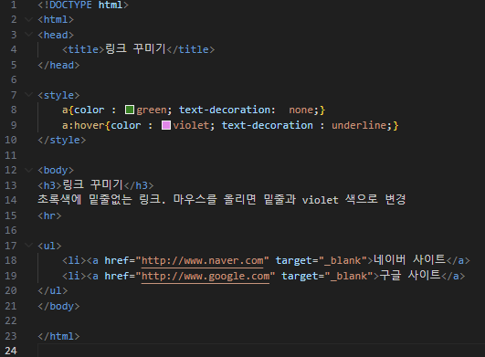
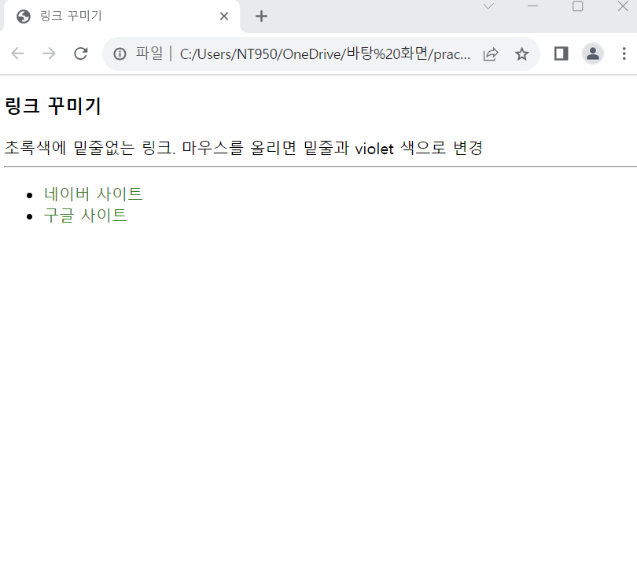

# (실습문제 6번)

### - 아래와 같이 밑줄이 없는 초록색 링크를 만들고 마우스가 올라가면 밑줄과 더불어 violet 색으로 바뀌도록 HTML 페이지를 작성하라.

 #### 추가 & 변경 사항

>    1. 스타일 시트 삽입
>    >
>    2. a구간 스타일 지정
>    >
>    3. a구간 기본 스타일 설정 : 컬러색 green, 밑줄효과 없음
>
>    4. a구간에 커서가 올라갔을 경우의 스타일 지정 : 컬러색 violet, 밑줄효과
>
>    5. (a구간에 있는 제목들은 하이퍼링크로 실제 페이지들과 연결될 수 있도록 설정)

 </img> 
 </img> 
