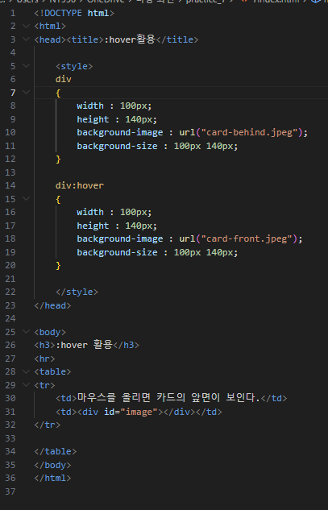
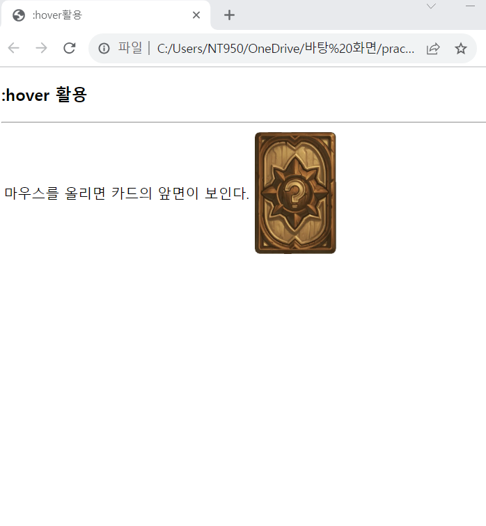

# (실습문제 7번)

### - 
태그를 이용하여 카드의 뒷면을 출력하고, 마우스를 올리면 카드의 앞면이 보이게 HTML 페이지를 작성하라.

 #### 추가 & 변경 사항

>    1. 스타일 시트 삽입
>    >
>    2. 구간별 설정(div, div:hover)
>    >
>    3. div구간 기본 스타일 설정 : 넓이:100, 높이:140, 배경 이미지 첨부(카드 뒷면), 배경 사이즈 지정(100*140)
>
>    4. div구간에 커서가 올라갈 시의 스타일 설정 : 넓이:100, 높이:140, 배경 이미지 첨부(카드 앞면), 배경 사이즈 지정(100*140)
>
>    5. (div의 id="image"로 설정)

 </img> 
 </img> 
