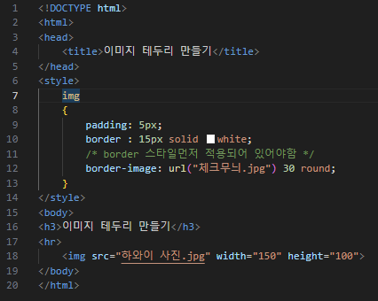
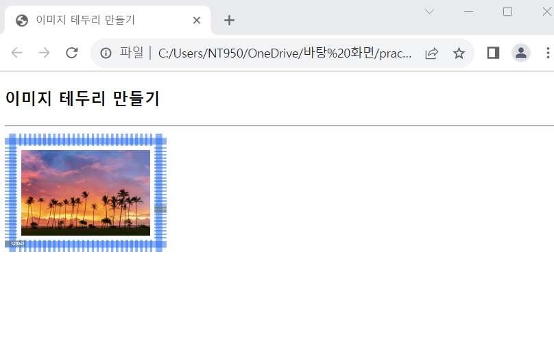

# (실습문제 8번)

### - 태그로 이미지를 출력하고, 액자 모양의 이미지 테두리를 만들어라. 테두리의 두께는 15px, 패딩은 5px로 하여 테두리와 이미지 사이에 공간이 있게 하라.

 #### 추가 & 변경 사항

>    1. 스타일 시트 삽입
>    >
>    2. img 구간 설정(padding : 5, border : 15/solid/white, border-image : 체크무늬 이미지 첨부 및 30round
>    >
>    3. (단, body의 첨부 사진의 크기는 150*100으로 지정)

 </img> 
 </img> 
