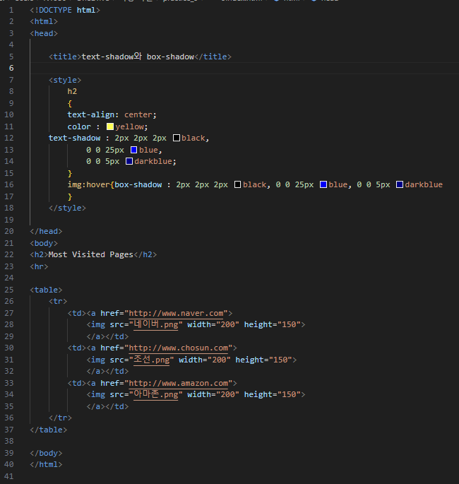
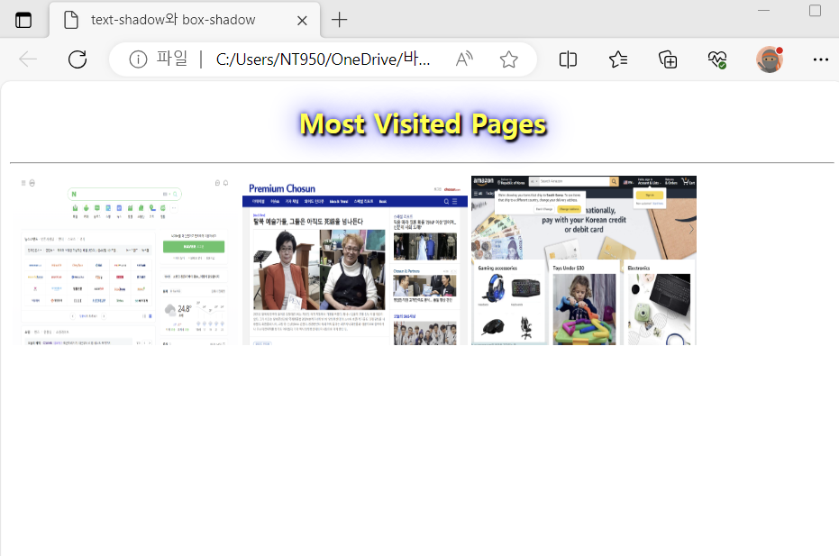

# (실습문제 9번)

### - 다음 페이지를 작성하라, most visited pages 텍스트를 text-shadowㅀ 꾸미고, 이미지에 마우스를 올리면 box-shadow를 이용하여 박스에 그림자가 보이게 하라.

 #### 추가 & 변경 사항

>    1. 스타일 시트 삽입
>    >
>    2. 구간별 설정(h2, img:hover)
>    >
>    3. h2 구간 설정(텍스트 중앙 정렬, 색 지정:yellow, 텍스트 그림자 지정(2 2 2 black & 0 0 25 blue & 0 0 5 darkblue))
>    >
>    4. img구간에 커서가 올라왔을 시에 효과 설정(box 그림자 지정2 2 2 black & 0 0 25 blue & 0 0 5 darkblue))
>    >
>    4. table구간의 tr구간에 있는 각 이미지들에 하이퍼 링크를 연결하여 이미지와 동일한 페이지가 새 창으로 나오도록 설정

 </img> 
 </img> 
