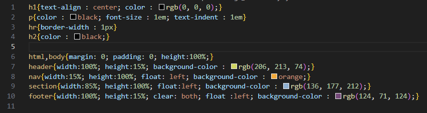
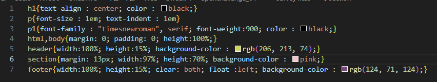
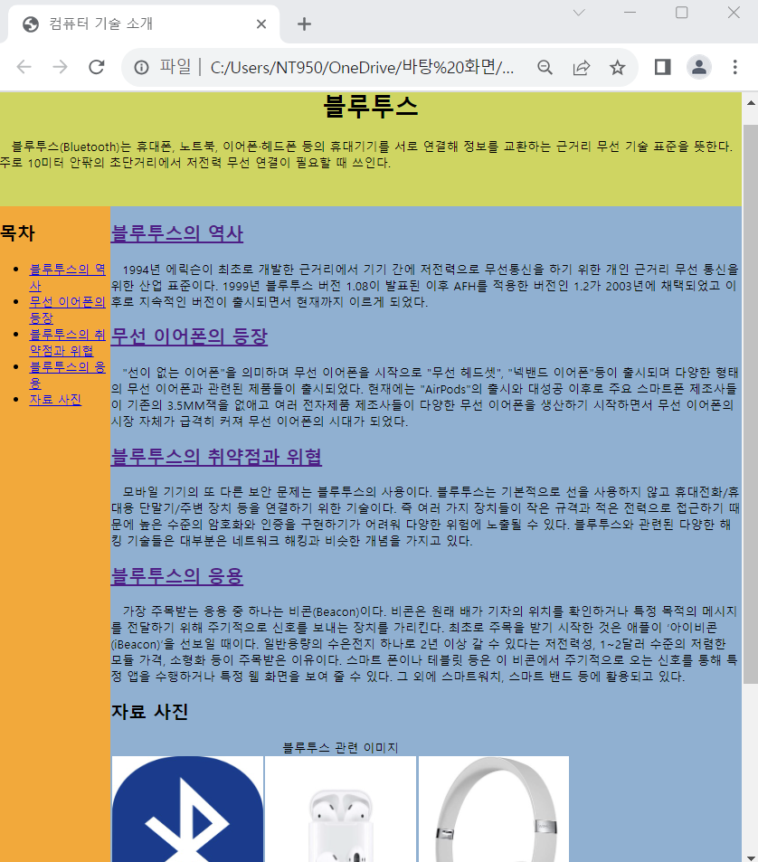
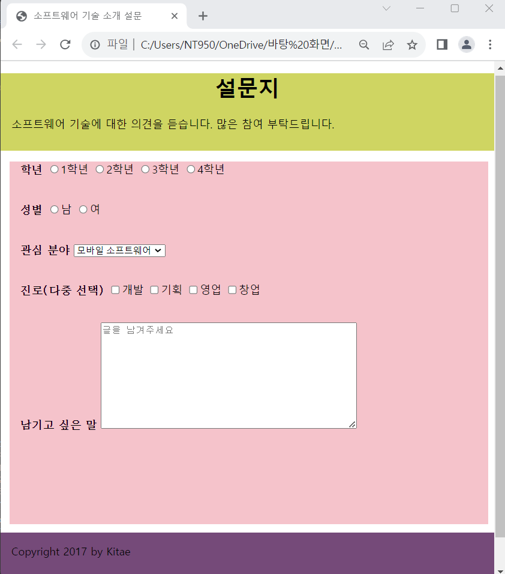

# Open Challenge 05

### 컴퓨터 기술 소개 웹 페이지 : CSS3로 태그 배치 하기

 #### 추가 및 안내 사항

>    1. html과 survey의 소스코드와 연결되어 있는 css소스코드 편집
>    >
>    2. html-css 설정
>    >- h1구간 설정(텍스트 중앙 정렬, 색 지정-black)
>    >- p구간 설정(컬러색 지정-black, 폰트 크기 1, text-indent : 1)
>    >- hr구간 설정(보더 길이 : 1)
>    >- h2구간 설정(컬러색 지정-black)
>    >- html,body구간 설정 (margin: 0. padding: 0,  height:100%)
>    >- header구간 설정(width:100%, height:15%, 배경색 지정-rgb(206, 213, 74))
>    >- nav구간 설정(width:15%, height:100%, float: left, 배경색 지정-orange;}
>    >- section구간 설정(width:85%, height:100%, float:left, 배경색 지정-rgb(136, 177, 212);}
>    >- footer구간 설정(width:100%, height:15%, clear: both, float :left, 배경색 지정-rgb(124, 71, 124);}
>    >
>    3. survey-css 설정
>    >- h1구간 설정(텍스트 중앙 정렬, 컬러색 지정-black)
>    >- p구간 설정(폰트크기 : 1em, text-indent : 1em)
>    >- p1구간 설정(글꼴 지정 : "timesnewroman", serif, font-weight:900, 컬러색 지정-black)
>    >- html,body구간 설정(margin: 0, padding: 0, height:100%)
>    >- header구간 설정(width:100%, height:15%, 배경색 지정-rgb(206, 213, 74))
>    >- section구간 설정(margin: 13px, width:97%, height:70%, 배경색 지정-pink)
>    >- footer구간 지정(width:100%, height:15%, clear: both, float : left, 배경색 지정-rgb(124, 71, 124)

 </img> 
 </img> 
 </img> 
 </img> 
