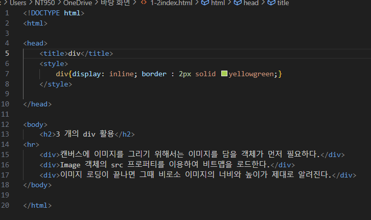
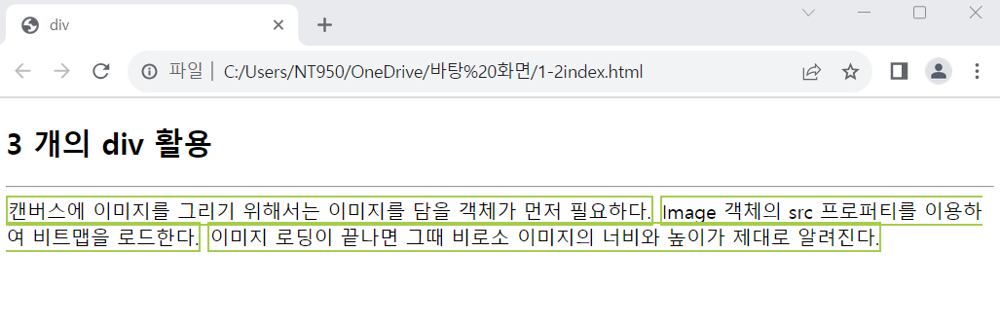

# (실습문제 1-2번)

### - display 프러퍼티를 이용하여 3개의 
에 담긴 텍스트가 다음 화면과 같이 출력되는 웹 페이즈를 작성하라.

 #### 추가 & 변경 사항

>    1. 스타일 시트 삽입
>    >
>    2. div구간 설정(display: inline, border : 2px/solid/yellowgreen)

 </img> 
 </img> 
