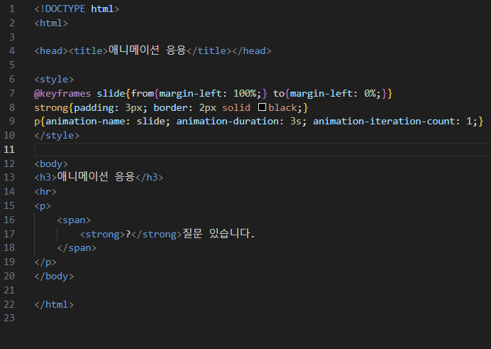
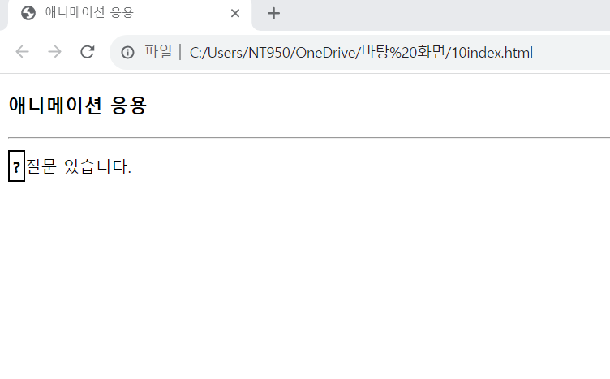

# (실습문제 10번)

### - p 문단의 텍스트가 오른쪽 끝에서 시작하여 왼쪽으로 3초에 걸쳐 펼쳐지도록 CSS3애니메이션을 작성하라. 애니메이션은 1회만 진행된다. p 문단을 오른쪽 끝에 출력하려면 margin-lift:100%로, 왼쪽에 출력하려면 margin-left:0%으로 하면 된다.

#### 추가 & 변경 사항

>    1. 스타일 시트 삽입
>    >
>    2. 구간별 설정()
>    >
>    3. ol구간 설정(@keyframes slide, strong, p)
>    >
>    4. @keyframes slide구간 설정(from{margin-left: 100%;} to{margin-left: 0%;})
>    >
>    5. strong구간 설정(padding: 3px, border : 2px/solid/black)
>
>    6. p구간 설정(애니메이션 이름 : slide, 애니메이션 지속시간 : 3s, 애니메이션 반복 횟수 : 1)

 </img> 
 </img> 
