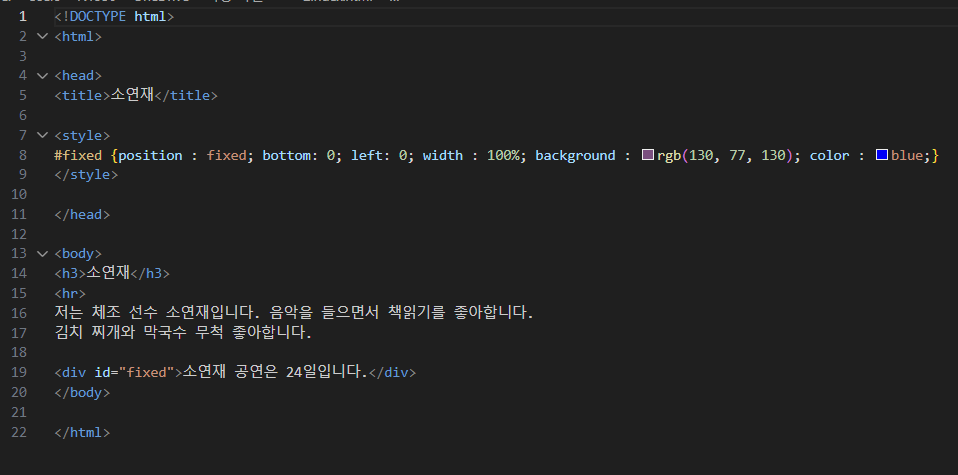
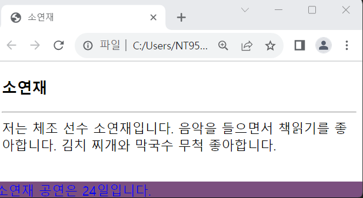

# (실습문제 2번)

### - position:fixed를 이용하여 다음과 같이 광고문이 항상 브라우저의 바닥에 나타나도록 작성하라. 광고문은 브라우저 폭의 100% 크기로 출력된다.

#### 추가 & 변경 사항

>    1. 스타일 시트 삽입
>    >
>    2. fixed구간 설정(position : fixed, bottom: 0, left: 0, width : 100%, 배경색 지정-rgb(130, 77, 130), 컬러색 지정-blue)

 </img> 
 </img> 
