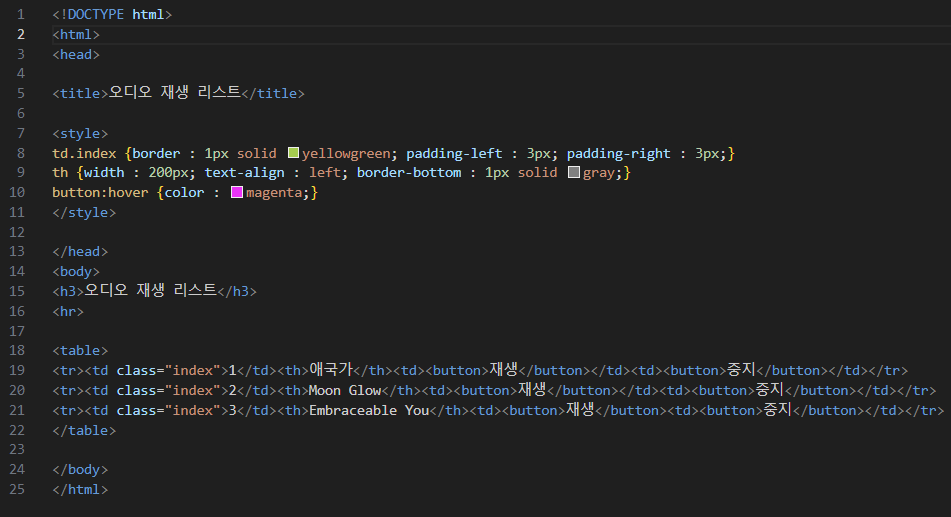
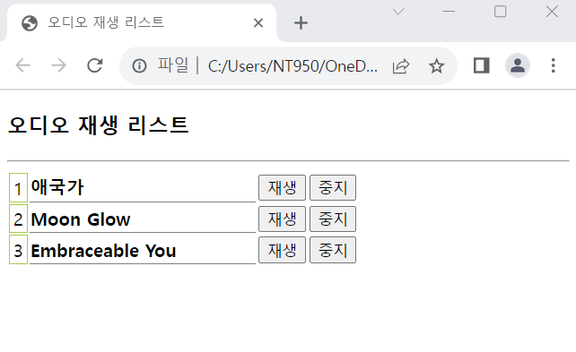

# (실습문제 3번)

### - HTML 태그와 CSS3을 이용하여 오디오 재생 리스트를 표로 작성하라, 또한 버튼에 마우스가 올라가면 버튼 글자가 magenta 색으로 바뀌게 하라. 버튼은 눌러도 작동하지 않는다.

#### 추가 & 변경 사항

>    1. 스타일 시트 삽입
>    >
>    2. 구간별 설정(td.index, th, button:hover)
>    >
>    3. th.index구간 설정(border : 1px/solid/yellowgreen, padding-left : 3px, padding-right : 3px)
>    >
>    4. th구간 설정(width : 200px, text-align : left, border-bottom : 1px/solid/gray)
>    >
>    5. button:hover구간 설정(컬러색 지정-magenta)
>
>    6. (body구간의 table의 td구간은 index의 클래스로 연결되어 있다.)

 </img> 
 </img> 
