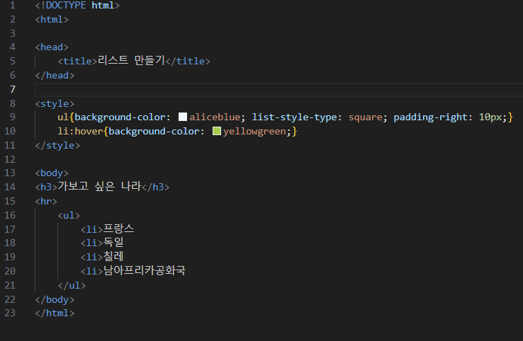
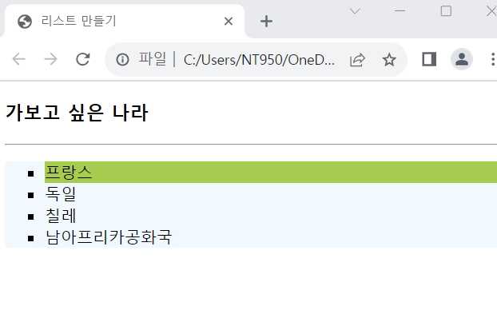

# (실습문제 4-1번)

### - 리스트와 CSS# 스타일 시트를 이용하여 다음과 같이 출력되는 HTML페이지를 작성하라.(리스트 아이템에 마우스를 올리면 색깔리 yellowgreen으로 변한다.)

#### 추가 & 변경 사항

>    1. 스타일 시트 삽입
>    >
>    2. 구간별 설정(ul, li:hover)
>    >
>    3. ul구간 설정(배경색 지정-aliceblue, list-style-type: square, padding-right: 10px)
>    >
>    4. li:hover구간 설정(배경색 지정-yellowgreen)

 </img> 
 </img> 
