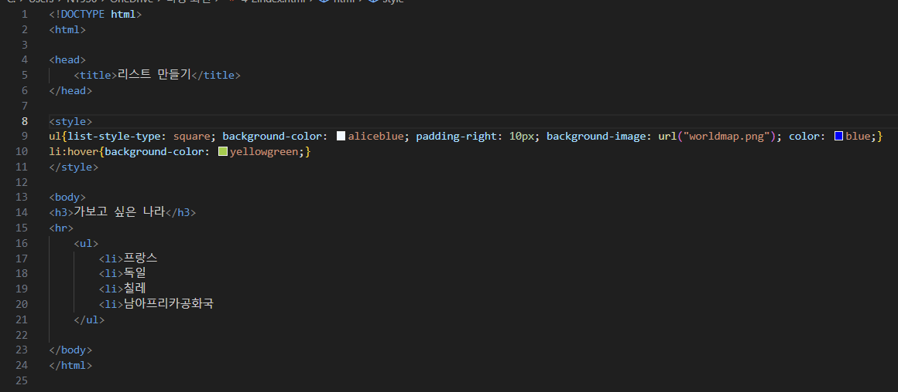
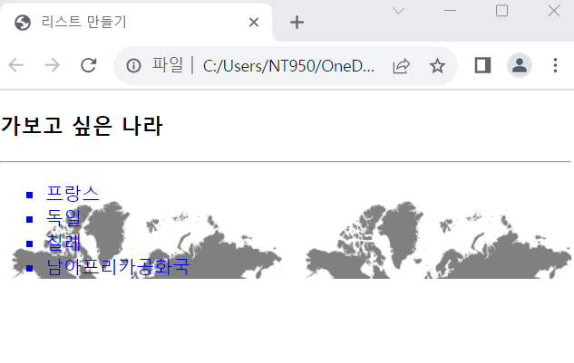

# (실습문제 4-2번)

### - 리스트와 CSS# 스타일 시트를 이용하여 다음과 같이 출력되는 HTML페이지를 작성하라.(세계지도(worldmap.png)를 리스트 배경으로 출력한다.)

#### 추가 & 변경 사항

>    1. 스타일 시트 삽입
>    >
>    2. 구간별 설정(ul, li:hover)
>    >
>    3. ul구간 설정(list-style-type: square, 배경색 지정-aliceblue, padding-right: 10px, 배경 이미지-worldmap.png, 컬러색 지정-blue)
>    >
>    4. li:hover구간 설정(배경색 지정-yellowgreen)

 </img> 
 </img> 
