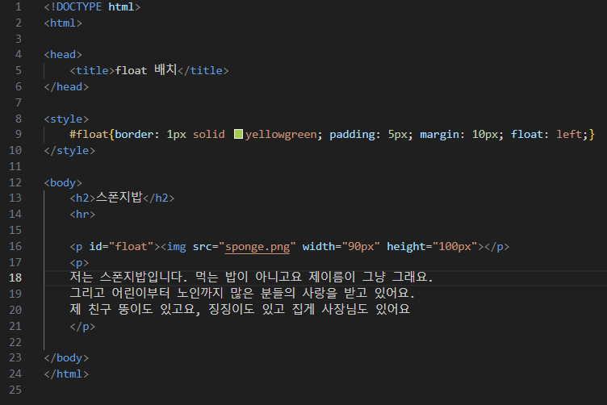
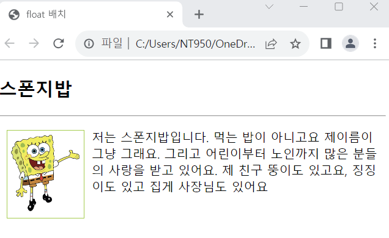

# (실습문제 5번)

### - 스폰지밥 이미지가 왼쪽 모서리에서 10px 떨어진 위치에 항상 나오도록 아래와 같은 웹 페이지를 작성하라. 이미지에 테두리를 두르고 여백은 10px, 패딩은 5픽셀로 하라. 

#### 추가 & 변경 사항

>    1. 스타일 시트 삽입
>    >
>    2. float구간 설정(border: 1px/solid/yellowgreen, padding: 5px, margin: 10px, float: left)

 </img> 
 </img> 
