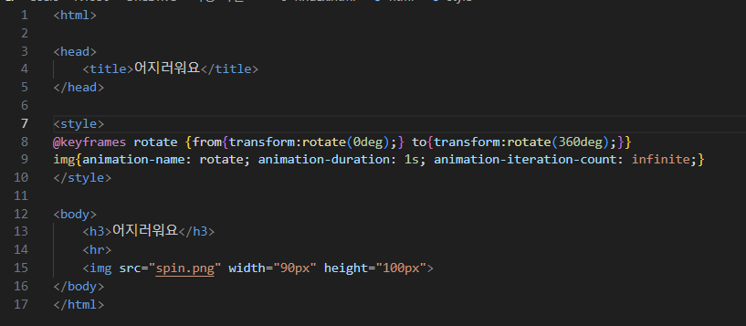
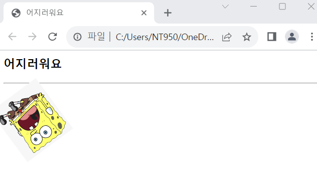

# (실습문제 6-1번)

### - 이미지를 회전시키는 애니메이션을 작성하라.(1초에 한 바퀴씩 무한번 반복한다.)

#### 추가 & 변경 사항

>    1. 스타일 시트 삽입
>    >
>    2. 구간별 설정(@keyframes rotate, img)
>    >
>    3. @keyframes rotate구간 설정(from{transform:rotate(0deg);} to{transform:rotate(360deg);})
>    >
>    4. img구간 설정(animation-name: rotate, animation-duration: 1s, animation-iteration-count: infinite)

 </img> 
 </img> 
