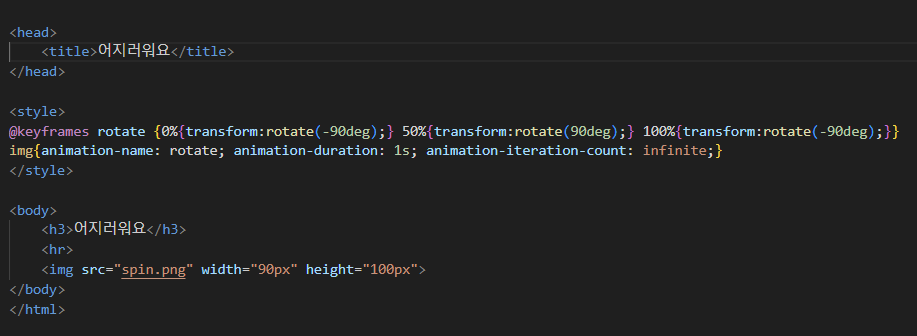
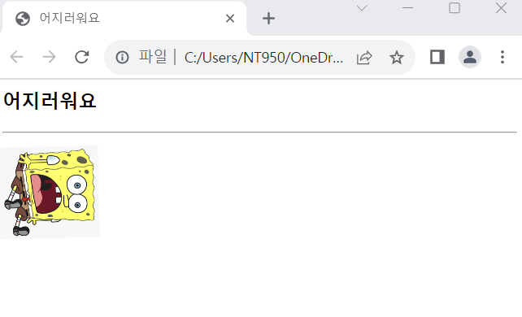

# (실습문제 6-2번)

### - 이미지를 회전시키는 애니메이션을 작성하라.(왼쪽으로 90도 갔다가 다시 오른쪽으로 90도 가기를 1초에 1번씩 무한 반복한다.))

#### 추가 & 변경 사항

>    1. 스타일 시트 삽입
>    >
>    2. 구간별 설정(@keyframes rotate, img)
>    >
>    3. @keyframes rotate구간 설정(0%{transform:rotate(-90deg);} 50%{transform:rotate(90deg);} 100%{transform:rotate(-90deg);})
>       - 이미지 횐정 정도 설정
>    >
>    4. img구간 설정{애니메이션 이름: rotate, 에니메이션 지속시간 : 1s, 애니메이션 반복 횟수: infinite;}

 </img> 
 </img> 
