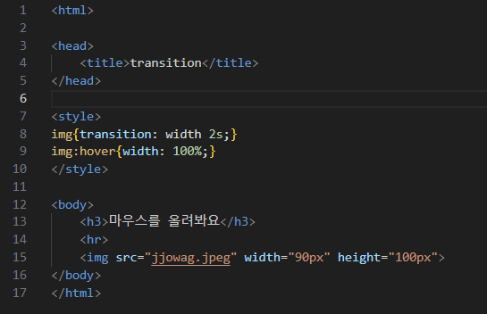

# (실습문제 7번)

### - 아래 왼쪽과 같은 웹 페이지를 작성하고, CSS3을 이용하여 이미지에 마우스를 올리면 오른쪽과 같이 이미지의 폭이 2초에 걸쳐 부드럽게 브라우저 폭의 크기로 늘어나는 에니메이션을 작성하라

#### 추가 & 변경 사항

>    1. 스타일 시트 삽입
>    >
>    2. 구간별 설정(img, img:hover)
>    >
>    3. img구간 설정(transition: width 2s)
>    >
>    4. img:hover구간 설정(width: 100%)
>    >
>    >- 2초동안 100%의 폭으로 늘어난다.

 </img> 
 </img> 
