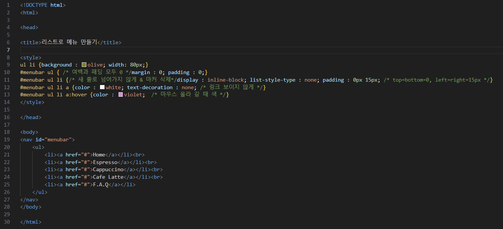
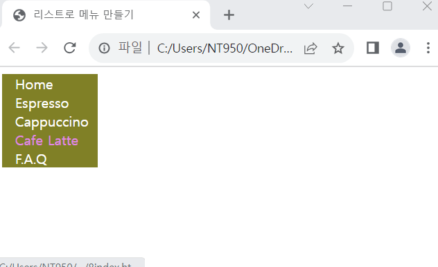

# (실습문제 8번)

### - 예제 5-9를 수정하여 다음과 같이 상하로 출력되는 메뉴를 만들어라.

#### 추가 & 변경 사항

>    1. 스타일 시트 삽입
>    >
>    2. 구간별 설정(ul li, menubar ul, menubar ul li, menubar ul li a, menubar ul li a:hover)
>    >
>    3. ul li구간 설정(배경색 지정-olive, width : 80)
>    >
>    4. menubar ul구간 설정(margin : 0, padding : 0)
>    >
>    5. menubar ul li구간 설정(display : inline-block, list-style-type : none, padding : 0px 15px)
>
>    6. menubar ul li a구간 설정(컬러색 지정-white, text-decoration : none)
>
>    7. menubar ul li a:hover구간 설정(컬러색 지정-violet)

 </img> 
 </img> 
