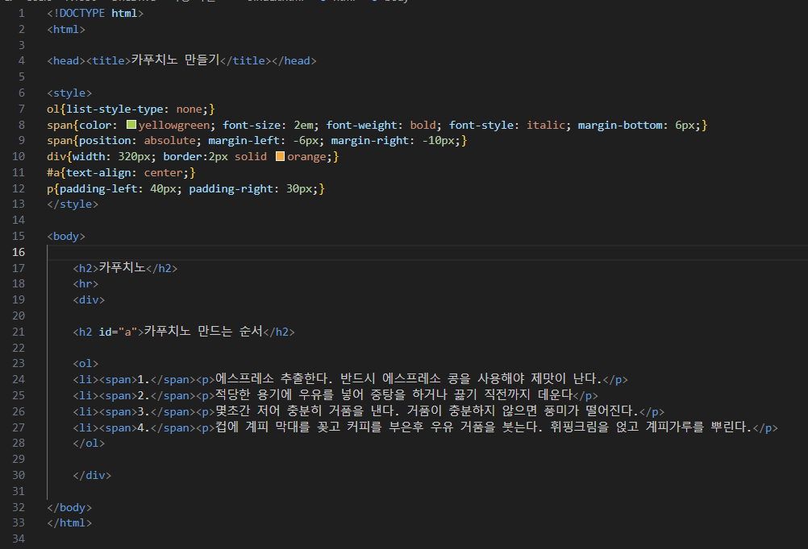

# (실습문제 9번)

### - ol태그를 이용하여 '카푸치노를 만드는 과정'을 웹 페이지로 만들어 보자. 마커를 크게 만들기 위해 다음 CSS3를 이용하여 마크를 제거하고 직접 숫자를 준다.

#### 추가 & 변경 사항

>    1. 스타일 시트 삽입
>    >
>    2. 구간별 설정(ol, span, div, #a, p)
>    >
>    3. ol구간 설정(list-style-type: none)
>    >
>    4. span구간 설정(컬러색 지정-yellowgreen, font-size: 2em, font-weight: bold, 글꼴-italic, margin-bottom: 6px
>    >               position: absolute, margin-left: -6px, margin-right: -10px)
>    >
>    5. div구간 설정(width: 320px, border:2px solid orange)
>
>    6. a구간 설정(텍스트 중앙 정렬)
>
>    7. p구간 설정(padding-left: 40px, padding-right: 30px)

 </img> 
 </img> 
