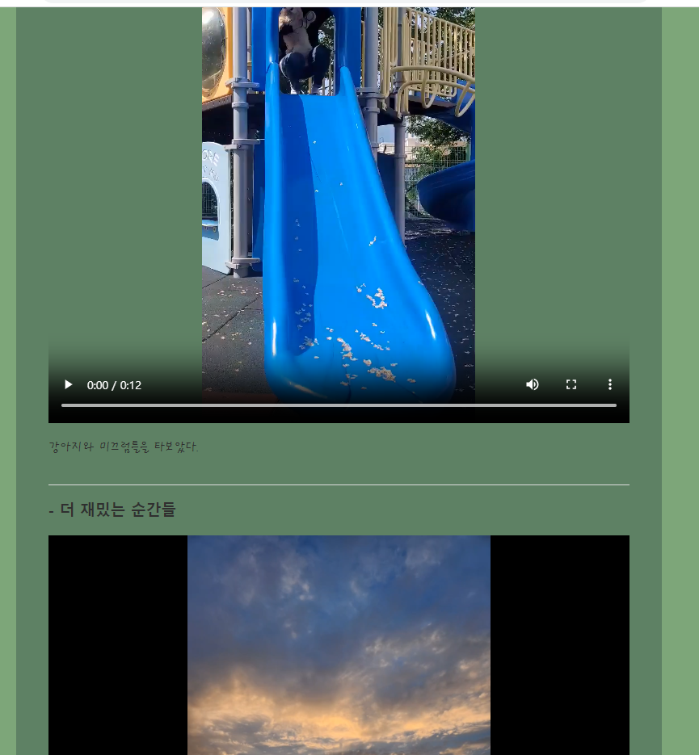

# 개인 콘텐츠 만들기

### 자기소개 페이지 만들기 : 각종 효과들을 넣어 꾸며보자

 #### 추가 및 안내 사항

>    1. index.html과 해당 페이지의 효과를 담당하는 style.css의 소스코드 편집
>    >
>    2. 기능 설명
>    >- 이미지 에니메이션 추가
>    >- 카테고리에 커서가 닿일 시 글씨 효과 부여
>    >- section구간 글씨체 변경
>    >- 카테고리 하이퍼링크 연결
>    >- 영상 추가 및 컨트롤러 삽입
>    >- (자세한 사항은 이미지 소스코드 참조)

 </img> 
 </img> 
 </img> 
 </img> 
 </img> 
