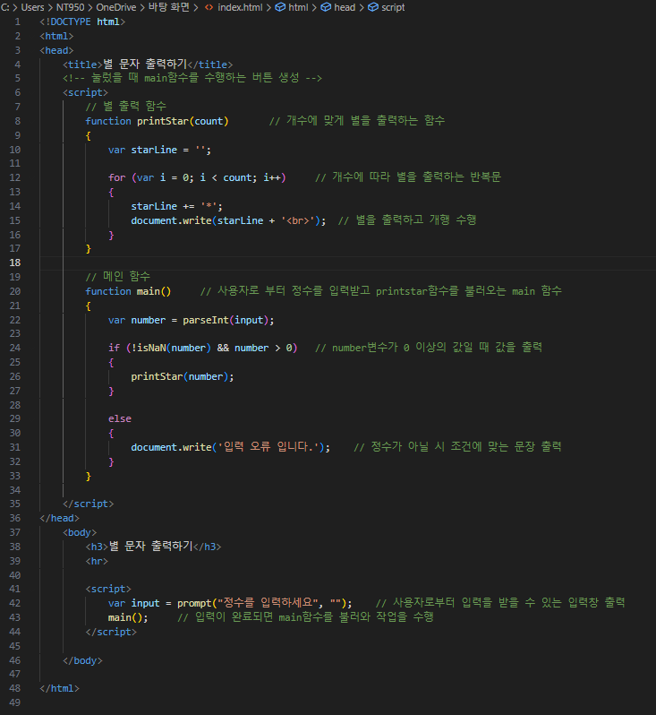
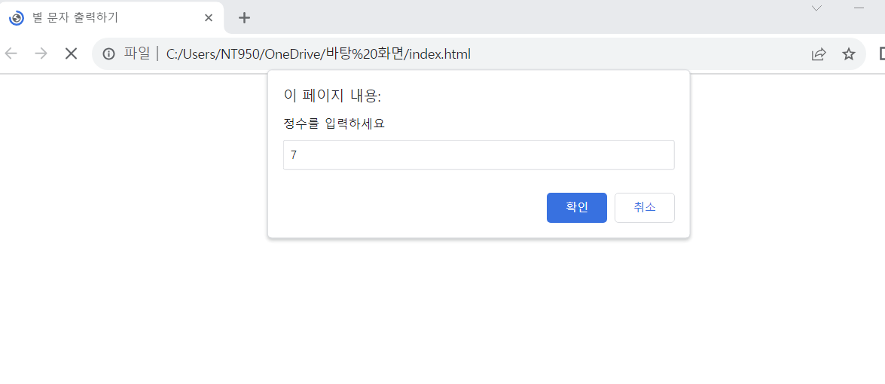
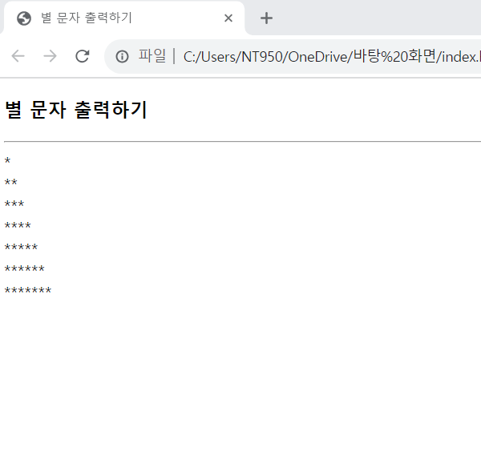
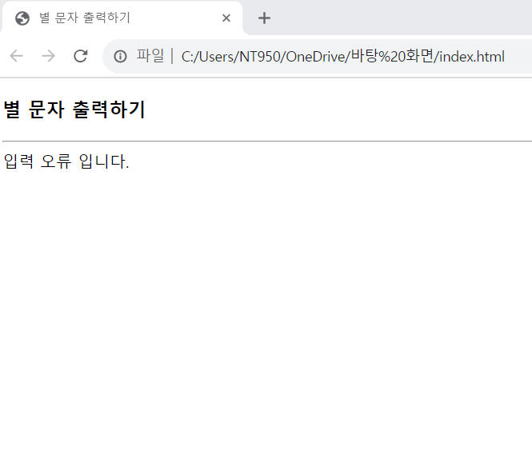

# 별문자(*) 출력하기

### 다음 조건을 따라 prompt()로 정수를 입력받아 개수만큼 *를 출력하는 웹 페이지를 작성하라.

 #### 추가 및 안내 사항

>    1. 별 문자를 출력하는 함수의 이름은 printStar()로 지정
>    >
>    2. Prompt()입력 창에 양의 정수가 입력되지 않았을 시 "입력 오류입니다." 출력
>    >
>    3. 별 출력 함수와 메인 함수로 구 

 </img> 
 </img> 
 </img> 
 </img> 
