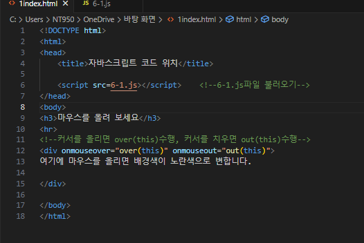
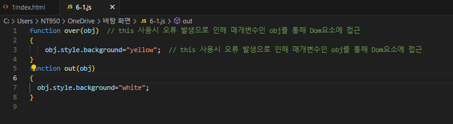
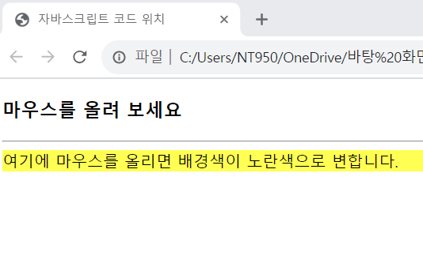

# HTML 페이지와 풀력 결과를 보고 물음에서 요구하는 대로 페이지를 수정하라.

 #### 추가 및 안내 사항

>    1. HTML 페이지를 수정하여 자바스크립트 코드를 <script>태그에 삽입
>    >
>    2. 자바스크립트 코드를 6-1.js 파일에 저장하고 <script>태그로 6-1.js 파일을 불러오도록 HTML 페이지를 수정
>    >
>    3. 커서를 올리고 내렸을 때 수행되는 div 객체 생성

 </img> 
 </img> 
 </img> 

