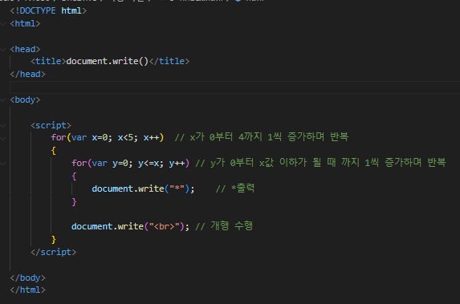
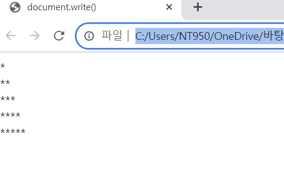

# document.write()를 이용하여 문제 2에 주어진 <script> 태그에 자바스크립트 코드를 완성하여 다음과 같이 출력되게 하라.

 #### 추가 및 안내 사항

>    1. for문 사용(x의 값이 0부터 4까지 1씩 증가하며 반복)
>    >
>    2. for문 사용(y의 값이 0부터 x의 값 이하까지 1씩 증가하며 반복)
>    >
>    3. 반복적인 개행 수행

 </img> 
 </img> 

