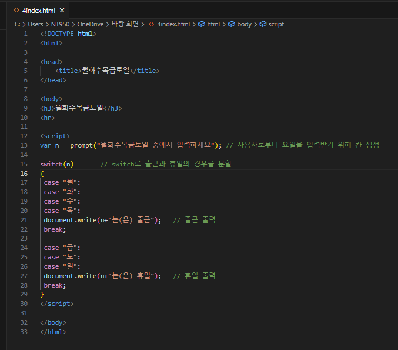
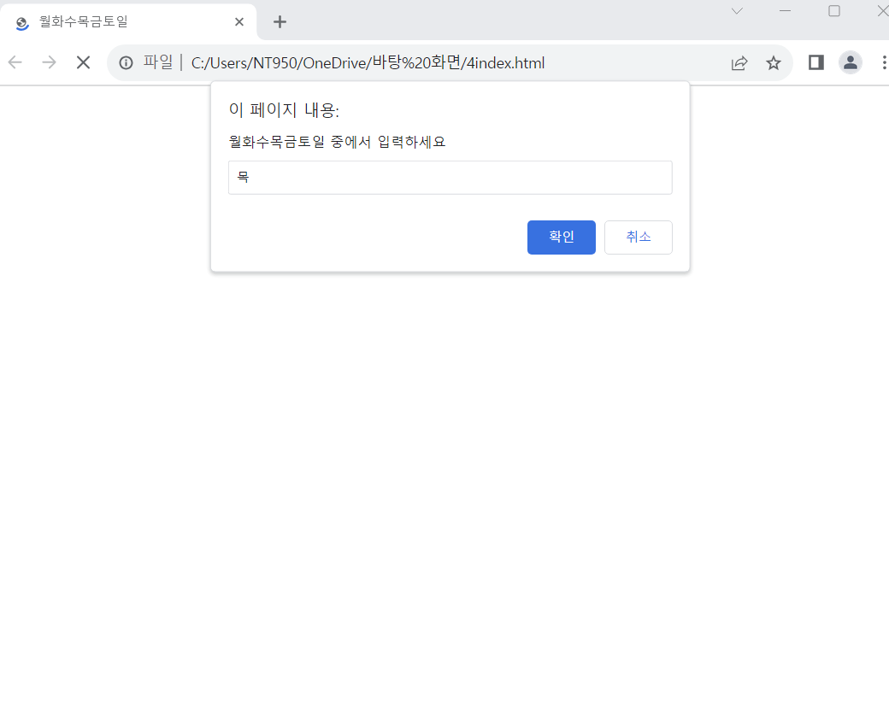
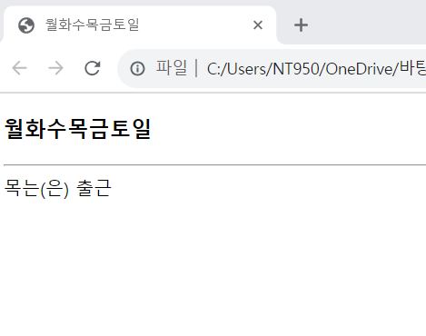

# prompt()함수를 이용하여 월, 화, 수, 목, 금, 토, 일 중 하나를 입력받아 월~목의 경우 "출근"을, 다른 날의 경우 '휴일'을 출력하는 자바스크립트 코드를 작성하여 웹 페이지를 완성하라.

 #### 추가 및 안내 사항

>    1. 사용자로부터 요일을 입력받기 위한 입력창 생성
>    >
>    2. switch문으로 휴일의 경우와 출근의 경우를 분할

 </img> 
 </img> 
 </img> 

