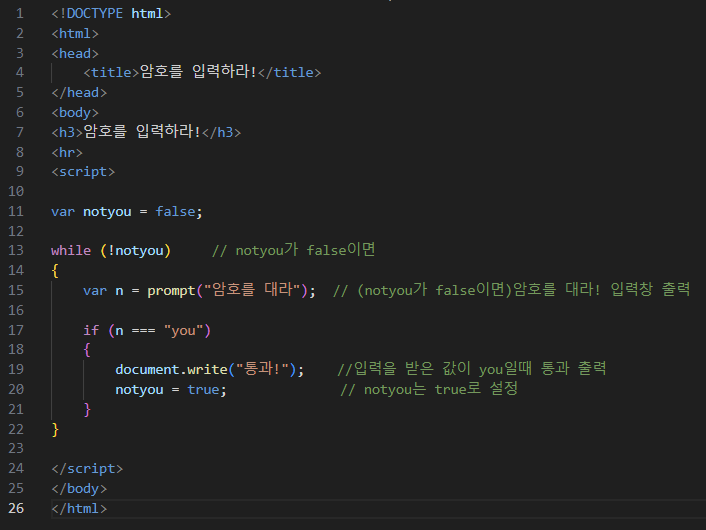

# 정확한 암호가 입력될 때까지 계속 prompt()를 출력하여 암호를 입력받는 웹 페이지를 작성하라. 암호는 you이다. you가 입력되면 통과!가 출력된다.

 #### 추가 및 안내 사항

>    1. you가 입력될 때까지 암호를 입력받는 입력창 출력
>    >
>    2. you가 입력되면 통과! 출력 후 종료

 </img> 
 </img> 
 </img> 

