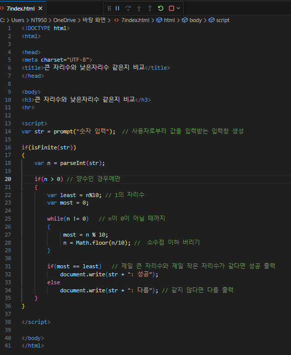
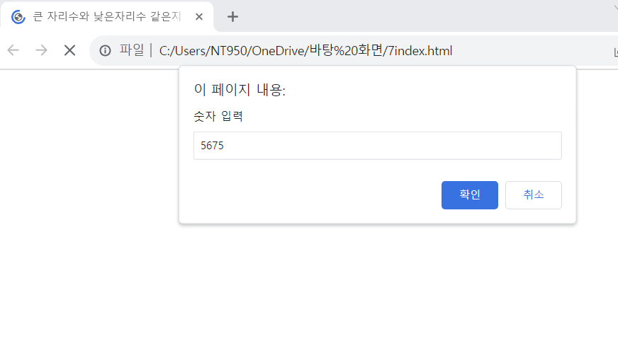
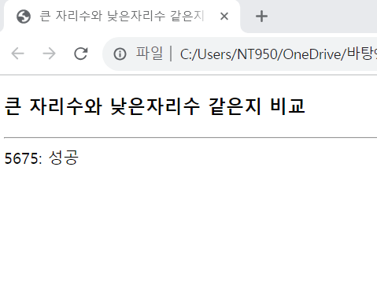

# prompt()함수로 사용자로부터 숫자를 입력받고 제일 큰 자리 수와 제일 낮은 자리의 수가 같으면 '성공', 아니면 '다름'을 출력하는 웹 페이지를 작성하라. 문자열 연산으로 풀지말고 while을 이용하여 제일 큰 자리의 수와 낮은 자리의 수를 구하여 풀도록 하라.

 #### 추가 및 안내 사항

>    1. 사용자로부터 값을 입력받는 입력창 생성
>    >
>    2. if문 사용(양수인 경우에만 수행)
>    >
>    3. while문 사용(n의 값이 0이 아닐때 까지, n의 값을 10으로 나누고 소수점 이하는 버리는 작업 반복)
>    >
>    4. if문 사용(조건에 따른 성공, 다름 출력)

 </img> 
 </img> 
 </img> 

