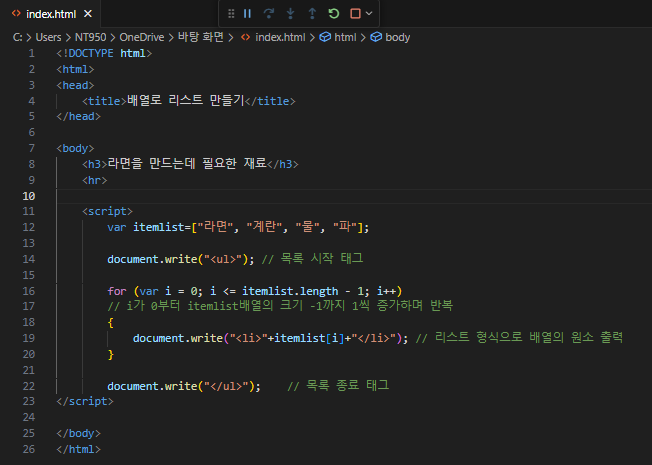
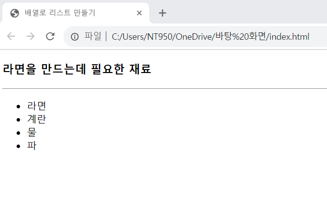

# 배열을 리스트의 아이템으로 출력하기

### 다음 배열에 들어 있는 각 문자열을 다음 브라우저 화면과 같이 리스트의 아이템으로 출력하는 웹 페이지를 작성하라.

 #### 추가 및 안내 사항

>    1. 목록 시작 태그와 종료 태그 선언
>    >
>    2. for문 사용(i의 값이 0부터 배열의 길이-1만큼의 값 까지 1씩 증가하며 반복하여 원소를 출력)

 </img> 
 </img> 

