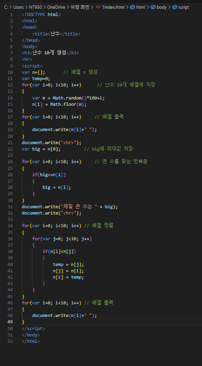
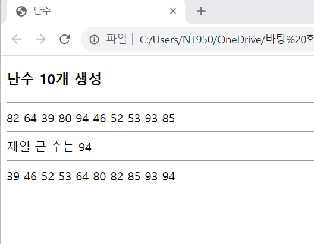

# 1에서 100(100포함)사이의 난수 10개를 생성하여 plots 이름의 배열에 저장하고, 배열에 저장된 수 중 가장 큰 수를 출력하는 웹 페이지를 작성하라.

 #### 추가 및 안내 사항

>    1. 배열 생성 후 난수 10개를 배열에 저장
>    
>    2. for문 사용(배열 생성 후 난수 10개를 배열에 저장)
>    
>    3. for문 사용(배열 출력)
>
>    4. for문 사용(큰 수를 찾는 반복문)
>
>    5. for문 사용(배열을 정렬하는 반복문)
>
>    6. for문 사용(배열을 순차적으로 출력하는 반복문)

 </img> 
 </img> 
