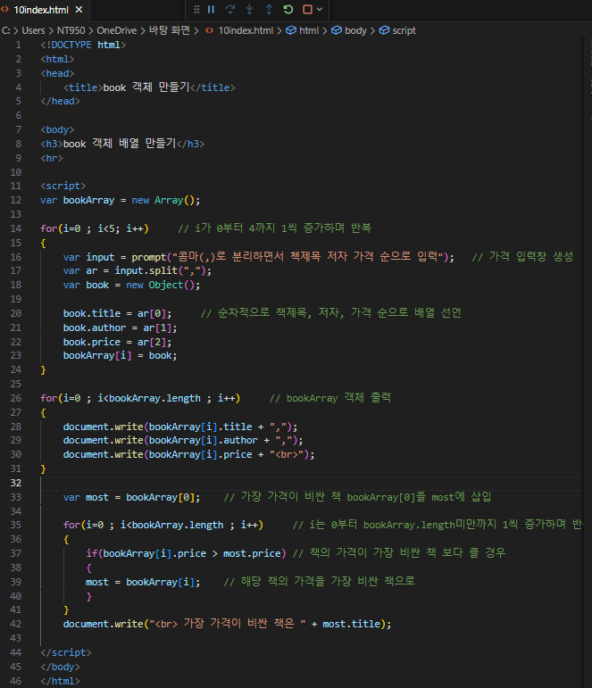
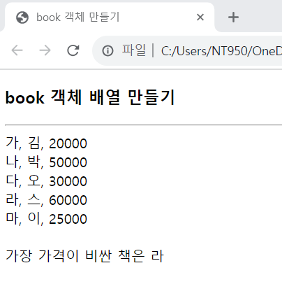

# 문제 9의 (1)에서 new Object()를 이용하여 생성한 book 객체를 이용하여 book의 객체 배열 bookArray를 생성하고, 다음과 같이 prompt() 함수를 통해 5개 책 정보를 입력받은 후 가장 비싼 책의 이름을 출력하는 웹 페이지를 작성하라.

 #### 추가 및 안내 사항

>    1. for문 생성(i가 0부터 4까지 1씩 증가하며 반복하며 가격 입력 창 생성 반복, 순차적으로 책제목, 저자, 가격 순으로 배열 반복)
>
>    2. for문 생성(bookArray 객체 출력)
>
>    3. for문 생성(i가 0부터 bookArray.length미만까지 1씩 증가하며 반복하여 가장 비싼 가격의 책을 식별하는 작업 반복)

 </img> 
 </img> 

