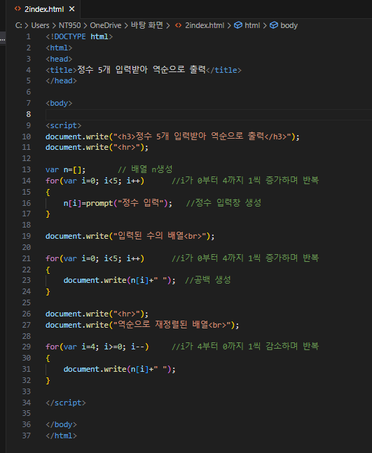
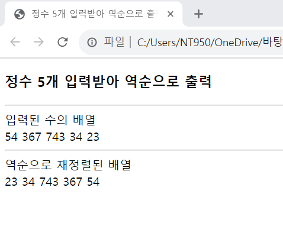

# prompt()함수를 반복 호출하여 5개의 정수를 입력받아  배열에 저장하고 입력돤 반대 순으로 출력하는 웹 페이지를 작성하라.

 #### 추가 및 안내 사항

>    1. 배열 생성
>
>    2. for문 생성(i가 0부터 4까지 1씩 증가하며 반복해 정수의 입력창을 출력하는 반복문)
>
>    3. for문 생성(i가 0부터 4까지 1씩 증가하며 반복해 공백을 생성하는 반복문)
>
>    4. for문 생성(i가 4부터 0까지 1씩 감소하며 반복하며 원소의 값과 공백을 출력하는 반복)

 </img> 
 </img> 

