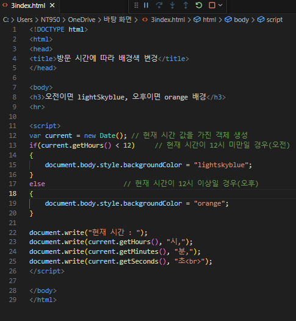
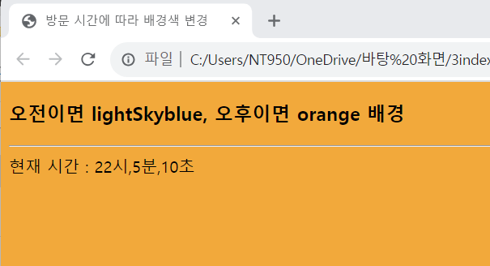

# 예제 7-6을 수정하여 웹 페이지를 접속할 때 오전이면 배경색을 lightskyblue로, 오후면 orange로 출력되게 하라.

 #### 추가 및 안내 사항

>    1. 현재 시간 값을 가진 객체 생성
>    
>    2. 현재 시간이 12시 미만일 경우 오전으로 설정
>    
>    3. 현재 시간이 12시 이상일 경우 오후로 설정

 </img> 
 </img> 

