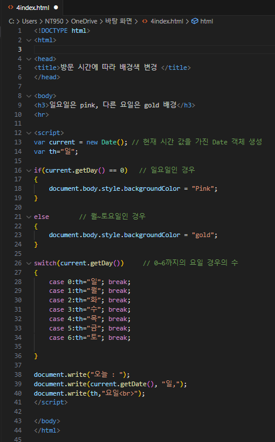
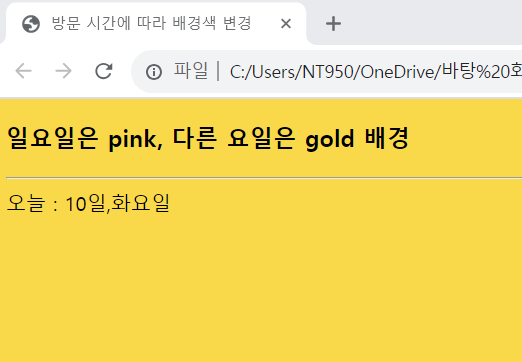

# 예제 7-6을 수정하여, 웹 페이지를 접속할 때 월요일~토요일이면 배경색을 gold로, 일요일이면 pink로 출력되게 하라.

 #### 추가 및 안내 사항

>    1. 현재 시간 값을 가진 Date 객체 생성
>    
>    2. if문 사용(일요일인 경우, 월~토요일인 경우)
>    
>    3. switch문 사용(0~6까지의 요일의 경우의 수)

 </img> 
 </img> 

