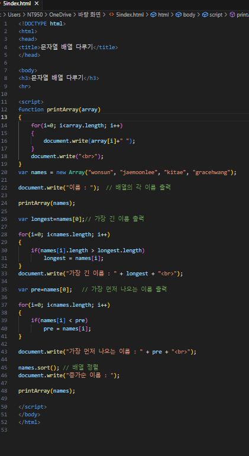
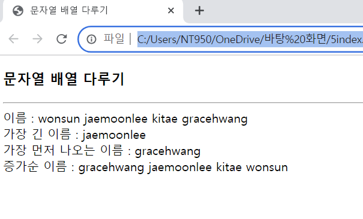

# 이름 문자열이 들어있는 배열 names의 형태를 보고 다음 문항에서 요구하는 자바스크립트 코드를 작성하라.
## var names = new Array("wonsun", "jaemoonlee", "kitae", "gracehwang");

### names 배열에 들어 잇는 각 이름을 출력하라.
### names 배열에서 가장 긴 이름을 출력하라.
### names 배열에서 사전에서 가장 먼저 나오는 이름을 출력하라.
### names 배열을 증가 순으로 재 정렬하여 출력하라.

#### 추가 및 안내 사항

>    1. array 인수를 가지는 함수 선언
>    
>    2. var 태그와 for문을 이용한 선언(array 원소를 갖는 변수, 가장 긴 이름을 출력, 가장 먼저 나오는 이름 출력)

 </img> 
 </img> 

