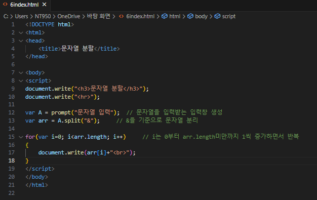
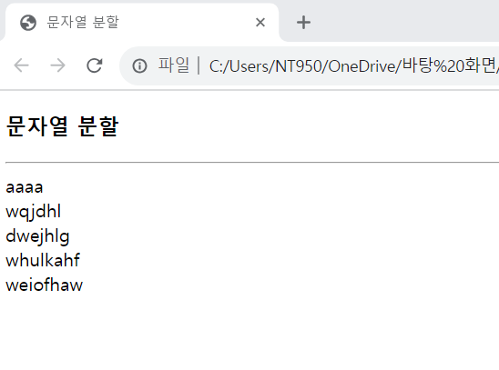

# prompt() 함수를 호출하여 사용자로부터 문자열을 입력받고 "&"문자를 기준으로 분할하여 출력하는 웹 페이지를 작성하라.

 #### 추가 및 안내 사항

>    1. 문자열을 입력받는 입력창 생성
>    
>    2. &을 기준으로 문자열 개행 진행
>    
>    3. for문 사용(i는 0부터 배열 미만의 값까지 1씩 증가하면서 반복)

 </img> 
 </img> 

