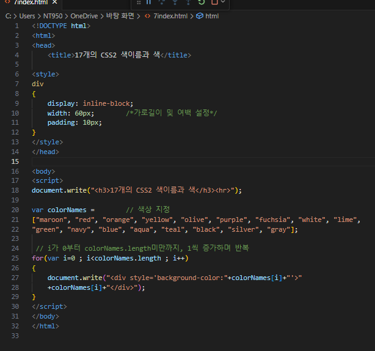
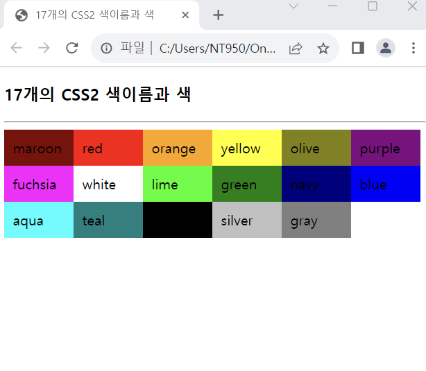

# 다음과 같이 색 이름을 가진 문자열 배열 colorNames를 만들고, 문자열을"
" 태그로 출력하라. <"div"> 태그의 배경색은 해당 색으로 칠하라.

 #### 추가 및 안내 사항

>    1.가로길이 및 여백 크기 설정
>    
>    2. colorNames배열의 원소에 색상 지정
>    
>    3. for문 사용(i가 0부터 배열의 값 미만까지 1씩 증가하며 원소 출력)

 </img> 
 </img> 

