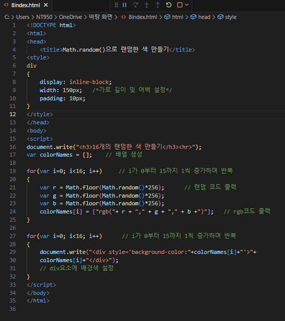
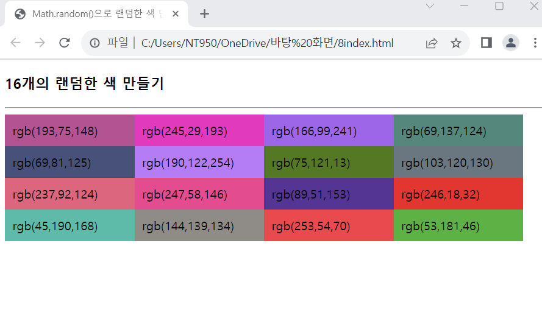

# 다음 브라우저 화면과 같이, document.write()을 이용하여 16개의 <div.> 태그를 출력하고 각 <div.> 태그에 출력되는 배경색을 랜덤한 색으로 칠하는 웹 페이지를 작성하라. 웹 페이지를 로드할 때마다 색이 랜덤하게 바뀐다.

 #### 추가 및 안내 사항

>    1. 가로길이 및 여백 크기 설정
>    >
>    2. 배열 생성
>    >
>    3. for문 사용(i가 0부터 15까지 1씩 증가하며 랜덤 코드 출력)

 </img> 
 </img> 

