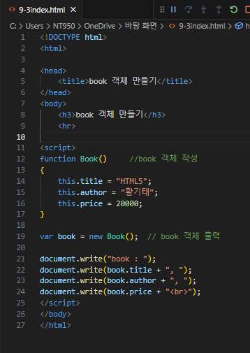
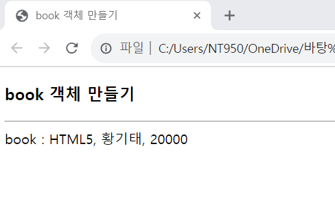

# book 객체를 만들려고 한다. 이 객체는 title, author, price의 3개의 프로퍼티로 구성되며 각 프로퍼티는 "HTML5", "황기태", 20000으로 각각 초기화 된다.

### new Object()를 이용하여 book 객체를 작성하고 객체를 출력하라.
### 리터럴 표기법으로 book객체를 작성하고 객체를 출력하라.
### 프로토타입 Book을 작성하고 book 객체를 출력하라.

 #### 추가 및 안내 사항

>    1. book 객체 작성(프로토타입 Book 작성)
>    >
>    2. book 객체 작성
>    >
>    3. book 객체 출력

 </img> 
 </img> 

