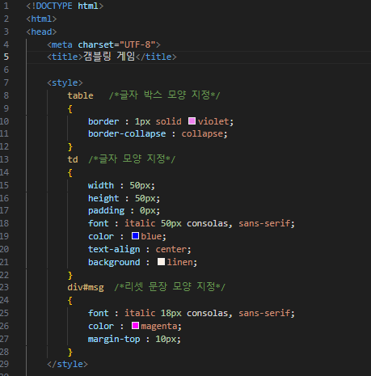
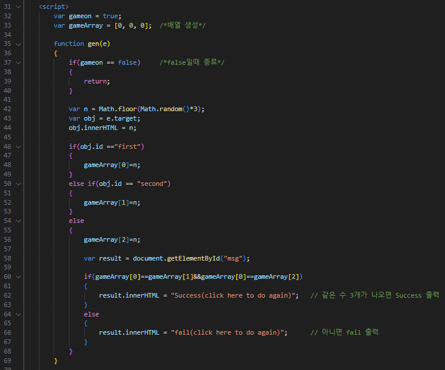
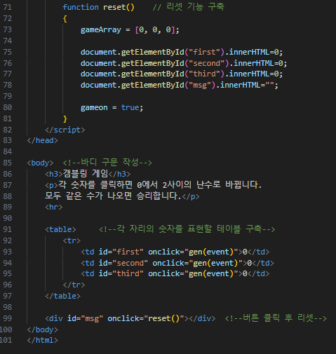
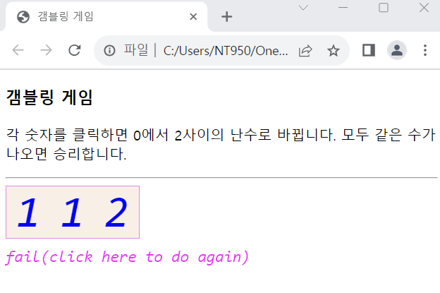
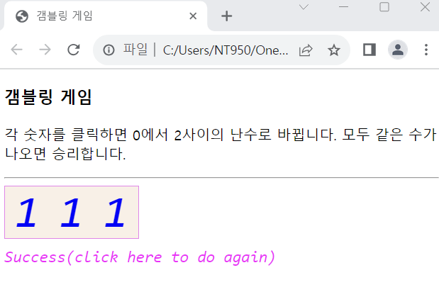

# 갬블링 게임 웹 페이지 만들기

### 3개의 숫자가 모두 같으면 성공하는 갬블링 게입 웹 페이지를 작성하라

 #### 추가 및 안내 사항

>    1. 기본 값으로 000을 출력
>    >
>    2. 각 숫자를 클릭하면 0~2 사이의 랜덤한 값이 출력
>    >
>    3. 마지막 숫자를 클릭할 때를 기준으로 세 개의 숫자가 모두 같으면 성공문장을 출력
>    >
>    4. 마지막 숫자를 클릭할 때를 기준으로 세 개의 숫자가 모두 같지 않으면 실패 문장을 출력

 </img> 
 </img> 
 </img> 
 </img> 
 </img> 
