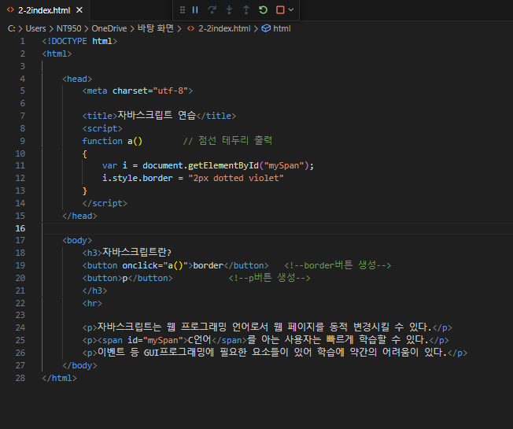
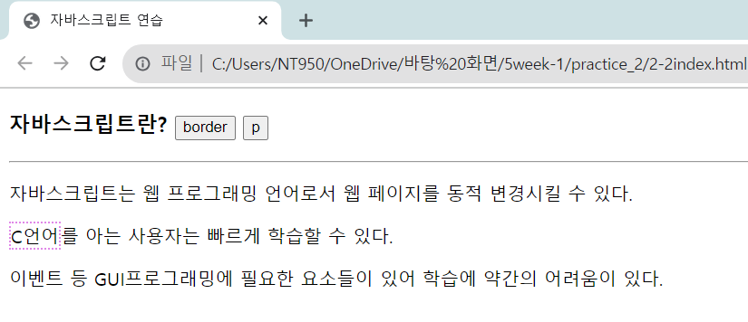

# HTML 페이지와 브라우저의 출력 결과를 보고 "border" 버튼을 클릭하면 다음과 같이 id="mySpan"인태그에 2픽셀의 violet 색 점선 테두리가 생기도록 자바스크립트 코드를 작성하라.

 #### 추가 및 안내 사항

> 2픽셀 violet점선 테두리를 나타내는 CSS3 스타일은 "2px dotted violet"이다.

 </img> 
 </img> 
