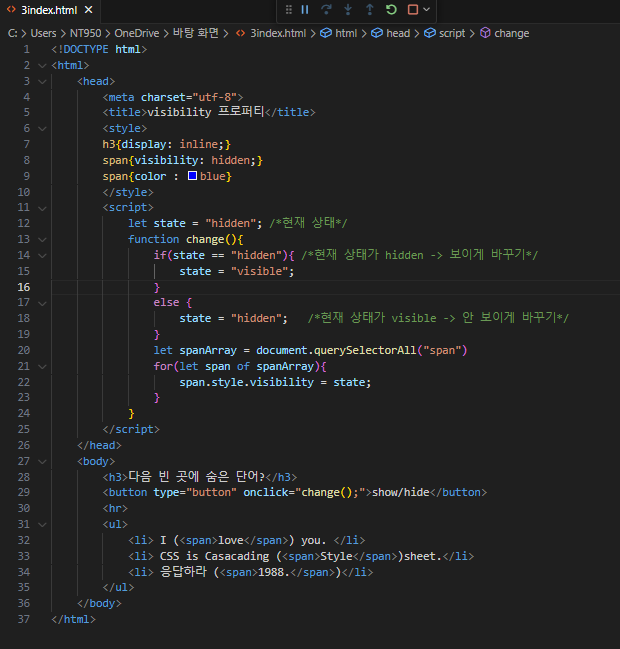
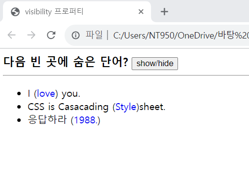

# 다음은 예제 5-7을 수정하여 출력한 결과이다. 예제에 버튼(show/hide)을 추가하고 자바스크립트 코드를 삽입하여 버튼을 클릭하면 답이 보이게 하고, 다시 클릭하면 숨기도록 구현하였다. 웹 페이지를 작성하라.

 #### 추가 및 안내 사항

>  괄호 안은 모두 &ltspan"&gt; 태그로 되어 있기 때문에, getElementsByTagName("span")으로  &ltspan"&gt; 태그들을 찾고, CSS3의 visibility 프로퍼티의 값을 "hidden"이나 "visible"로 지정하면 된다.

 </img> 
 </img> 
