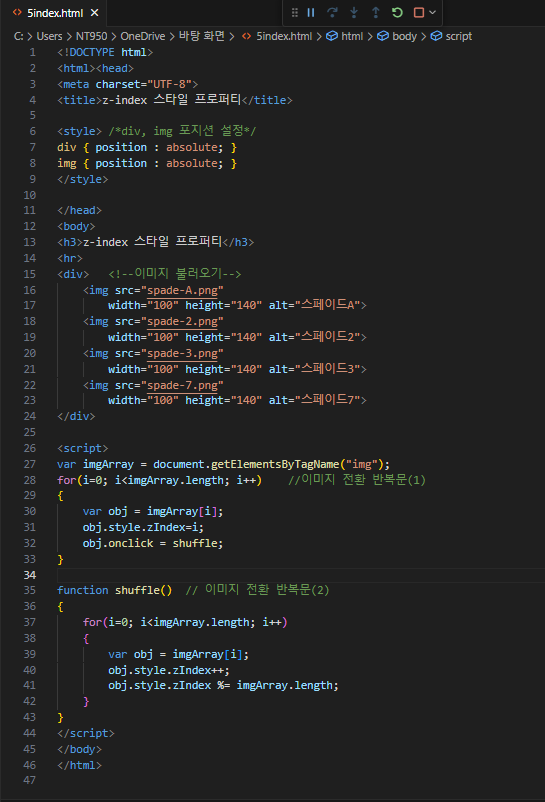
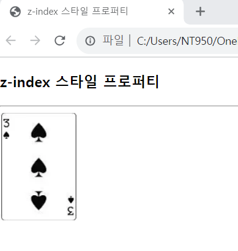

# 다음 HTML 페이지를 출력하면 동일한 크기의 카드 4개가 겹쳐 있어, 맨 위에 배치된 카드만 보인다. 이것은 각 카드 이미지의 z-index 스타일 프로퍼티 값을 다르게 설정하여 값이 클수록 위에 배치되도록 하였기 때문이다. 카드 이미지를 클릭하면 클릭된 카드가 맨 밑으로 들어가고 바로 밑의 카드가 나타나도록, 자바스크립트 코드를 작성하라.

 #### 추가 및 안내 사항

>   1. getElementsByTagName("img")로 ‘&lt;img&gt; 태그를 모두 알아내어 z-index 스타일 프로퍼티 값을 0부터 1씩 증가시키면서 지정하고 left, top 프로퍼티를 모두 같게 하면 겹쳐 출력된다.
>   >
>   2. 모두 동일한 자바스크립트 코드를 onclick 리스너로 등록, onclick 리스너에서는 각 이미지의 z-index 값을 수정하여 밑의 카드가 보이게 한다.

 </img> 
 </img> 
