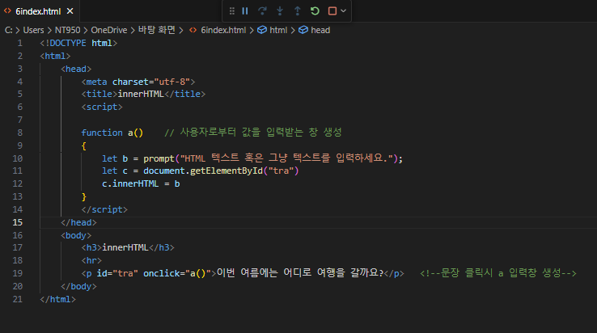
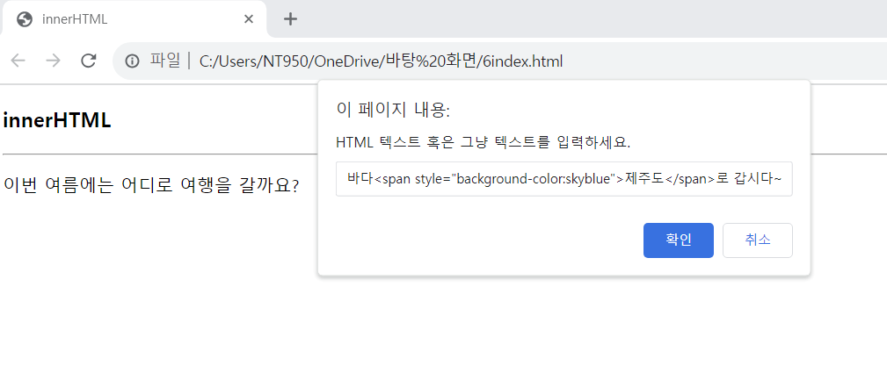
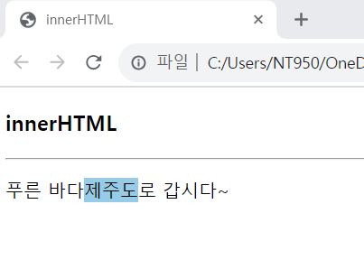

# DOM 객체의 innerHTML 프로퍼티를 다루는 연습을 해보자, 다음과 같이 ‘&lt;p‘&gt;‘&lt;/p‘&gt; 태그로 출력된 텍스트에 마우스로 클릭하면, prompt()창을 출력하고 사용자가 입력한 HTML 텍스트로 ‘&lt;p‘&gt; 태그의 내용을 바꾸는 웹 페이지를 작성하라.

 #### 추가 및 안내 사항

>   1. 문장을 클릭하면 사용자로 부터 입력을 받는 입력창 생성
>   >
>   2. 입력창 내에 사용자로부터 HTML 텍스트를 입력받을 수 있도록 설정
>   >
>   3. 입력창의 확인 버튼을 눌렀을 때 입력된 HTML 텍스트가 수행되도록 설정

 </img> 
 </img> 
 </img> 
